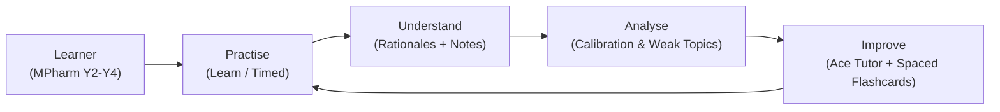
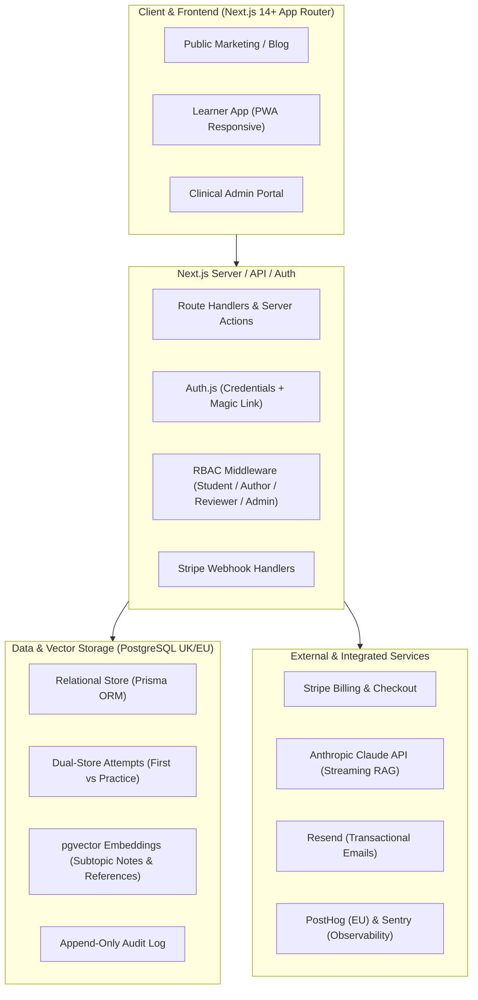
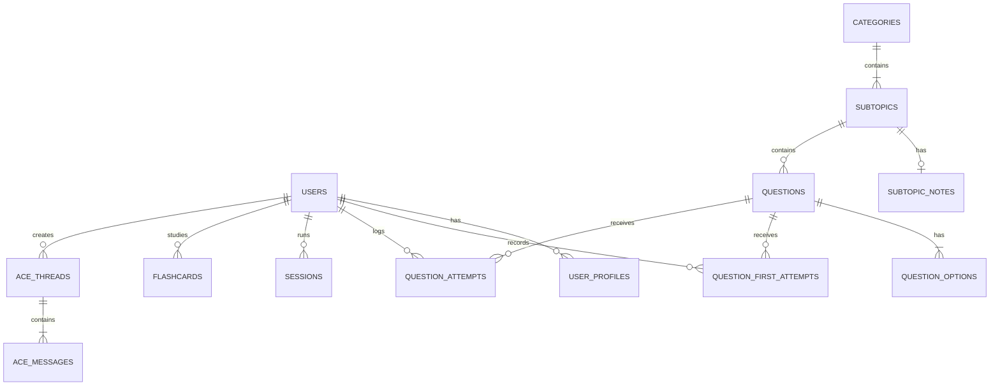

# Implementation Plan: AcePharm UK Pharmacy Revision Platform

> **Document Status**: Approved for Build Reference · Version 2.1  
> **Client**: Takween Centre UK Ltd  
> **Audience Target**: UK MPharm Students (Years 2–4), Foundation Trainees, and GPhC Candidates  
> **Companion References**: `AcePharm-Developer-Brief-v2.1.docx`, `AcePharm-Website-Copy-v2.0.docx`, `acepharm-prototype-vision.html`

---

## 1. Executive Overview & Product Vision

AcePharm is a next-generation subscription revision and clinical reasoning platform built exclusively for UK pharmacy students. It delivers high-yield, curriculum-mapped practice questions, deeply structured clinical explanations with individual option rationales, intelligent progress analytics, and an integrated, retrieval-grounded AI tutor (**Ace**).



### 1.1 Core Subsystems
1. **Public Marketing & Content Hub**: High-converting, SEO-optimised public portal with transparent pricing, editorial standards, blog, and legal compliance.
2. **High-Performance Learner Application**: Fast, mobile-first responsive test-taking engine, session builder, explanation reader, spaced-repetition flashcards, and progress dashboard.
3. **Clinical Admin & Content Portal**: Authoring environment, peer-review workflow, curriculum manager, bulk question importer, report moderation, and AI oversight queues.
4. **The Ace AI Engine**: Retrieval-Augmented Generation (RAG) assistant strictly grounded in verified AcePharm clinical notes and BNF references, providing contextual explanations, calculation coaching, weekly revision planning, and consultation simulations.

### 1.2 Commercial Model & Access Tiers

| Tier | Price | Allowance & Features | AI Access |
| :--- | :--- | :--- | :--- |
| **Explorer (Free)** | £0 / month | 30 questions/month (resets monthly on signup anniversary), basic progress analytics. Permanent free tier (no credit card required). | ❌ Disabled |
| **Monthly Pro** | £4.99 / month | Unlimited questions, full analytics, Weak Area generator, Spaced Repetition, Consultation Simulator, Timed sessions. | ✅ Full Access |
| **Yearly Pro** | £49.99 / year | Identical features to Monthly Pro (£9.89 annual savings). Exact proration calculated on upgrades. | ✅ Full Access |

---

## 2. System Architecture & Technical Stack



### 2.1 Technology Decisions

| Layer | Selection | Rationale & Specifications |
| :--- | :--- | :--- |
| **Framework** | **Next.js 14+ (App Router)** | Strict TypeScript, Server Components for high SEO/speed, Server Actions for mutations. |
| **Styling & Design System** | **Tailwind CSS + CSS Custom Properties** | Geist Sans & Geist Mono typography. Strict CSS variable tokens ensuring future dark-mode switch without code rewrites. |
| **UI Components** | **shadcn/ui (Radix Primitives)** | Customised to AcePharm tokens: 8pt grid, 44px touch targets, accessible keyboard navigation. |
| **Database & Vector Search** | **PostgreSQL (UK/EU) + `pgvector`** | Managed Postgres hosted in UK/EU region (GDPR compliance). Native vector cosine similarity search for Ace RAG chunk retrieval. |
| **ORM** | **Prisma ORM** | Type-safe migrations and client generation. |
| **Authentication & RBAC** | **Auth.js (NextAuth v5)** | Credentials (Argon2id/bcrypt cost 12+) + Magic Links. Server-side session validation. Zero vendor lock-in. |
| **Payments** | **Stripe** | Stripe Checkout, Billing, Customer Portal, and cryptographically verified Webhooks. |
| **AI LLM Provider** | **Anthropic Claude 3.5 Sonnet** | Streaming responses, low-latency clinical grounding, prompt caching support, strict temperature settings ($T=0.1$). |
| **Transactional Email** | **Resend** | Verification emails, password resets, monthly usage warnings, report updates. |
| **Monitoring & Analytics** | **PostHog (EU) + Sentry** | Privacy-conscious product analytics and full-stack error tracking. |

---

## 3. Database Schema & Data Architecture

> [!IMPORTANT]
> **The Dual-Store Rule**: Learner answers are persisted across two distinct tables: `question_first_attempts` (permanent, immutable) and `question_attempts` (user-clearable practice history). Resetting a category removes practice history without altering first-attempt calibration.



### 3.1 Entity Model Definitions

#### 1. Identity & Profiles
- `users`: `id (UUID)`, `email (CITEXT, UNIQUE)`, `email_verified_at`, `password_hash`, `first_name`, `role (enum: student, author, reviewer, admin, super_admin)`, `status (enum: active, suspended, pending_deletion, deleted)`, `timezone (default: Europe/London)`, `marketing_opt_in (bool)`, `created_at`, `updated_at`.
- `user_profiles`: `user_id (FK)`, `stage (enum: year_2, year_3, year_4, foundation_trainee, other)`, `primary_goal (enum: passing_exams, high_score, general_mastery)`, `assessment_date (DATE, nullable)`, `daily_question_target (INT, default: 20)`, `university_id (FK, nullable)`, `show_confidence_prompt (bool, default: true)`, `hide_options_by_default (bool, default: false)`, `show_difficulty_labels (bool, default: true)`.
- `universities`: `id (UUID)`, `name`, `email_domain`, `active (bool)`.

#### 2. Curriculum & Clinical Content
- `pathways`: `id`, `name (MPharm, Foundation Training, etc.)`, `slug`, `status (enum: active, coming_soon)`.
- `categories`: `id`, `pathway_id (FK)`, `name`, `slug`, `sort_order`, `description`, `icon`, `status (enum: draft, active, archived)`.
- `subtopics`: `id`, `category_id (FK)`, `name`, `slug`, `sort_order`, `status`.
- `subtopic_notes`: `id`, `subtopic_id (FK, UNIQUE)`, `content (Markdown/HTML)`, `version (INT)`, `last_reviewed_at`, `next_review_at`, `reviewed_by_user_id (FK)`, `status`.
- `content_chunks`: `id`, `source_type (subtopic_note, reference, explanation)`, `source_id (UUID)`, `chunk_index`, `content_text`, `embedding (vector(1536))`, `token_count`, `updated_at`.

#### 3. Question Bank & Validation
- `questions`: `id (UUID)`, `code (e.g. CARD-001)`, `primary_subtopic_id (FK)`, `secondary_subtopic_ids (JSON array)`, `title`, `vignette_text`, `question_text`, `explanation_lead`, `subtopic_note_ref_id (FK)`, `takeaway_point`, `difficulty (enum: easy, medium, hard)`, `type (enum: single_best_answer, calculation, emq)`, `status (enum: draft, in_review, changes_requested, approved, published, archived)`, `version (INT, default 1)`, `numeric_target (DECIMAL, nullable)`, `numeric_tolerance (DECIMAL, nullable)`, `numeric_unit (VARCHAR, nullable)`, `numeric_decimal_places (INT, nullable)`, `created_by_user_id (FK)`, `reviewed_by_user_id (FK)`, `created_at`, `published_at`.
- `question_options`: `id (UUID)`, `question_id (FK)`, `letter (A-E)`, `option_text`, `is_correct (bool)`, `rationale_text`, `sort_order`.

#### 4. Learner Activity & Dual-Store Engine
- `question_first_attempts` (*Permanent, Immutable Store*):
  `id`, `user_id (FK)`, `question_id (FK)`, `question_version (INT)`, `selected_option_id (FK)`, `is_correct (bool)`, `confidence (enum: low, medium, high, nullable)`, `time_taken_seconds (INT)`, `mode (enum: learn, timed)`, `answered_at (TIMESTAMP)`.
- `question_attempts` (*Working Practice Store, User-Clearable*):
  `id`, `user_id (FK)`, `question_id (FK)`, `question_version (INT)`, `session_id (FK, nullable)`, `attempt_number (INT)`, `selected_option_id (FK)`, `is_correct (bool)`, `confidence (enum: low, medium, high, nullable)`, `time_taken_seconds (INT)`, `mode`, `explanation_opened (bool)`, `answered_at`, `due_for_review_at`.
- `sessions`: `id`, `user_id (FK)`, `mode (learn/timed)`, `filters (JSON: categories, difficulty, status_pool, timing)`, `question_ids (UUID array, ordered)`, `current_index (INT)`, `started_at`, `completed_at`, `abandoned_at`, `total_time_seconds`.
- `question_reports`: `id`, `user_id (FK)`, `question_id (FK)`, `question_version (INT)`, `category (enum: clinical_error, typo, outdated_guideline, ambiguity, other)`, `comment (TEXT)`, `status (enum: open, investigating, resolved, dismissed)`, `assigned_to_user_id (FK)`, `resolution_notes`, `resolved_at`.

#### 5. The Ace AI Layer
- `ace_threads`: `id`, `user_id (FK)`, `context_type (enum: question, dashboard, planner, calculation, simulator)`, `context_id (UUID/String)`, `created_at`, `last_message_at`, `archived (bool)`.
- `ace_messages`: `id`, `thread_id (FK)`, `role (user/assistant/system)`, `content (TEXT)`, `intent (VARCHAR)`, `retrieved_chunk_ids (JSON array of UUIDs)`, `citations (JSON)`, `model (VARCHAR)`, `prompt_tokens (INT)`, `completion_tokens (INT)`, `latency_ms (INT)`, `cost_pence (DECIMAL)`, `flagged (bool)`, `created_at`.
- `flashcards`: `id`, `user_id (FK)`, `question_id (FK, nullable)`, `subtopic_id (FK)`, `front (TEXT)`, `back (TEXT)`, `source (enum: manual, ace_generated)`, `interval_days (FLOAT)`, `ease_factor (FLOAT, default 2.5)`, `repetitions (INT)`, `lapses (INT)`, `due_at (TIMESTAMP)`, `created_at`.
- `revision_plans`: `id`, `user_id (FK)`, `week_starting (DATE)`, `inputs_snapshot (JSON)`, `rationale (TEXT)`, `generated_at`.
- `simulator_scenarios`: `id`, `title`, `setting`, `patient_brief (JSON)`, `task_prompt`, `dialogue_turns (JSON)`, `clinical_rubric (JSON)`, `status (enum: active, draft, archived)`.
- `simulator_attempts`: `id`, `user_id (FK)`, `scenario_id (FK)`, `transcript (JSON)`, `turn_scores (JSON)`, `total_score (INT)`, `competency_band (VARCHAR)`, `feedback (TEXT)`, `completed_at`.

#### 6. Subscriptions, Access & Audit
- `subscriptions`: `id`, `user_id (FK, UNIQUE)`, `stripe_customer_id`, `stripe_subscription_id`, `plan (enum: monthly, yearly)`, `status (enum: active, past_due, canceled, trialing)`, `current_period_start`, `current_period_end`, `cancel_at_period_end (bool)`, `cancelled_at`, `cancellation_reason`.
- `free_tier_usage`: `user_id (FK, UNIQUE)`, `questions_answered_this_period (INT, limit: 30)`, `period_started_at (TIMESTAMP)`.
- `audit_log`: `id`, `actor_user_id (FK)`, `action`, `entity_type`, `entity_id`, `old_values (JSON)`, `new_values (JSON)`, `ip_address`, `created_at` (*Append-only, strictly immutable*).

---

## 4. Critical Engineering Rules & Edge Cases

> [!WARNING]
> **The 7 Architectural Traps to Guard Against**:
> 1. **Never combine attempt stores**: Single-table designs corrupt first-attempt honest calibration whenever a user resets practice history.
> 2. **Secondary topics in filtering only**: Secondary subtopics allow questions to appear in filtered sessions but must **never** double-count toward category coverage totals.
> 3. **Capture numeric metadata**: Calculation questions must store target value, tolerance, units, and decimal places immediately to support future free-text calculation mode without re-authoring 2,000+ questions.
> 4. **Multi-sensory feedback**: Answers must show border, icon, and explicit text (`Correct` / `Incorrect`) — never colour alone (WCAG 2.2 AA).
> 5. **Uninterrupted completion**: If question 30 hits the monthly free limit, the user must view the full question 30 explanation before seeing any upgrade prompt.
> 6. **Strict RAG refusal**: Ace must answer solely using retrieved chunk context with explicit citations; missing coverage must trigger clear clinical refusal, never hallucinated training inferences.
> 7. **Human-in-the-loop review gate**: AI-generated questions are saved as `draft` and strictly require human reviewer sign-off before entering active pools.

---

## 5. Detailed Phased Implementation Milestones

```mermaid
gantt
    title AcePharm Engineering Roadmap
    dateFormat  YYYY-MM-DD
    section Phase 1
    M1: Core Foundations & Auth             :m1, 2026-09-01, 10d
    M2: Content Pipeline & Ingestion        :m2, after m1, 8d
    section Phase 2
    M3: Question Engine & Session Flow      :m3, after m2, 14d
    M4: Dashboard, Analytics & Recs         :m4, after m3, 10d
    section Phase 3
    M5: The Ace AI Layer & RAG Architecture :m5, after m4, 14d
    M6: Public Marketing, SEO & Stripe      :m6, after m5, 10d
    section Phase 4
    M7: Hardening, a11y & Production Launch :m7, after m6, 8d
```

### Milestone 1 — Core Foundations & Infrastructure
- **Deliverables**:
  - Next.js 14+ TypeScript project configuration with ESLint, Prettier, and Husky hooks.
  - PostgreSQL database with `pgvector` extension enabled.
  - Complete Prisma schema covering all Milestone 1–7 entities and deferred-feature fields.
  - Design tokens setup in `globals.css` with CSS custom properties for typography, radius, and palette.
  - Auth.js v5 implementation: registration, email verification (Resend), credentials login, password reset flow, and server-side RBAC middleware.
  - Multi-tenant role permissions (`student`, `author`, `reviewer`, `admin`).
- **Acceptance Criteria**:
  - Account created, verified, and logged in on Staging.
  - Non-admin visiting `/admin` returns HTTP 403 Forbidden.
  - Database migrations execute cleanly from scratch.

### Milestone 2 — Content Pipeline & Seed Ingestion
- **Deliverables**:
  - Clinical Admin Portal UI: Curriculum hierarchy manager (Pathway $\rightarrow$ Category $\rightarrow$ Subtopic).
  - Rich Subtopic Notes Editor with markdown/table support and horizontal scroll wrappers.
  - Single Best Answer (SBA) & Calculation Question Editor with mandatory individual option rationales.
  - Review workflow: status transitions (`draft` $\rightarrow$ `in_review` $\rightarrow$ `approved` $\rightarrow$ `published`) with version tracking.
  - Excel/CSV bulk importer parsing questions, options, rationales, and metadata with diagnostic validation error reporting.
  - Ingestion and publication of the 135 seed questions across 19 categories.
- **Acceptance Criteria**:
  - Complete 135-question seed bank imported and published on Staging.
  - Form validation blocks any question lacking individual option rationales.

### Milestone 3 — The Question Engine & Session Experience
- **Deliverables**:
  - Session Builder: filter by category, subtopic, question status (Unseen, Incorrect, Flagged, All), mode (Learn vs Timed), and question count.
  - Question Screen (Desktop & Mobile):
    - Clinical vignette rendering with Geist Sans measure (65–75 chars).
    - Pre-submission confidence selector (Low / Medium / High, skippable per user setting).
    - Instant answer submission with optimistic UI (<300ms perceived response).
    - Hide-options mode toggle (per-user preference).
    - Full explanation layout: takeaway point, option-by-option rationale breakdown, shared subtopic notes.
    - Interactive tools: bookmarking, personal clinical notes, inline question reporting modal.
    - Keyboard navigation (A–E for options, 1–3 for confidence, Enter to submit, Space to proceed).
    - Dual-store recording: synchronous write to `question_first_attempts` (if first attempt) and `question_attempts`.
  - Session Summary: score breakdown, time per question, review grid, and jump-to-weak-topic triggers.
- **Acceptance Criteria**:
  - 20-question session completed on iOS Safari, Android Chrome, and Desktop browsers.
  - First-attempt record written once; subsequent attempts log to practice history only.
  - Category reset clears `question_attempts` while preserving `question_first_attempts`.

### Milestone 4 — Dashboard, Calibration Analytics & Recommendations
- **Deliverables**:
  - Learner Dashboard:
    - Meaningful session streak counter (minimum 5 questions or 10 active minutes).
    - Daily goal tracking with user-configured target (default 20 questions) resetting at midnight local timezone.
    - Dynamic Recommendation Engine: calculates highest-priority subtopic based on $\ge 5$ attempts, lowest first-attempt accuracy, and $\ge 5$ unseen questions remaining (with transparent reason displayed).
  - Progress & Analytics Hub:
    - Honest First-Attempt Accuracy vs Practice Accuracy vs Repeat Accuracy.
    - Confidence Calibration Matrix (High Confidence + Incorrect = Critical Blind Spot).
    - Curriculum Coverage Map (percentage of available questions attempted).
    - Weak Area Generator: single-click creation of a targeted revision session for subtopics below 60%.
- **Acceptance Criteria**:
  - New account displays clean empty states with guided calls-to-action.
  - Account with 100+ attempts displays explainable recommendation card with explicit rationale.

### Milestone 5 — The Ace AI Layer & Clinical RAG Architecture
- **Deliverables**:
  - Vector Embedding Pipeline: automated chunking of subtopic notes, explanations, and BNF references into `content_chunks` using `pgvector`.
  - "Ask Ace" Contextual Slide-Over Drawer:
    - Scoped conversation threads linked to active question ID.
    - Quick-prompt pills (*"Explain why B is wrong"*, *"Summarise first-line treatment"*, *"Show BNF monitoring parameters"*).
    - Highlight-to-ask text selection trigger in question stems and explanations.
    - Claude 3.5 Sonnet streaming response with inline clinical citations.
    - Comprehensive retrieval logging (`retrieved_chunk_ids`, prompt/completion tokens, cost tracking).
  - Spaced Repetition Flashcard Engine: SM-2 algorithm tracking ease factors, intervals, and daily due queues.
  - Ace Weekly Revision Planner: generates personalised 7-day study schedules from weak areas.
  - Ace Calculation Coach: step-by-step dimensional analysis and dose calculation breakdown.
  - Consultation Simulator: interactive scenario player scoring communication, clinical safety, and counseling technique against authored rubrics.
  - Safety & Guardrails: strict refusal prompt for out-of-domain queries and real patient clinical advice.
- **Acceptance Criteria**:
  - Ace passes 50+ automated clinical evaluation benchmarks with verified citations.
  - Out-of-curriculum and real patient queries trigger graceful refusal messages.
  - Full application remains operational if AI provider is disabled.

### Milestone 6 — Public Marketing Site, SEO & Stripe Subscriptions
- **Deliverables**:
  - Public Marketing Pages built with exact verbatim copy: Homepage, Features, Question Bank Overview, Ace AI Deep Dive, Pricing, About, Editorial Standards, FAQ, Contact, Legal Hub.
  - Database-backed Blog with Admin Markdown Editor.
  - Cookie Consent Banner (strictly blocking non-essential tracking prior to consent).
  - SEO Optimization: metadata, JSON-LD structured data (MedicalWebPage / Quiz), XML sitemaps, OpenGraph cards. Lighthouse score 90+ across all metrics.
  - Stripe Integration:
    - Free tier enforcement (30 questions/month counter with soft modal upgrade trigger after question explanation).
    - Stripe Checkout for Monthly (£4.99) and Yearly (£49.99) plans.
    - Stripe Billing Webhook handler managing renewals, cancellations, and payment failures.
    - In-app 2-step online cancellation flow.
  - Transactional Emails via Resend: welcome, email verification, password reset, payment receipts, cancellation confirmations.
- **Acceptance Criteria**:
  - Full customer journey verified in Stripe Test Mode: visitor $\rightarrow$ free account $\rightarrow$ 30 questions $\rightarrow$ paywall $\rightarrow$ Stripe checkout $\rightarrow$ unlimited access $\rightarrow$ self-service cancellation.

### Milestone 7 — Enterprise Hardening, Security & Launch Readiness
- **Deliverables**:
  - Admin Operations: User management, reported questions queue, support ticketing, audit log viewer, AI usage and cost monitoring dashboard.
  - Accessibility Audit: full WCAG 2.2 Level AA compliance verification (keyboard traps, ARIA attributes, contrast ratios $\ge 4.5:1$, screen reader labels).
  - Performance Tuning: database indexing on session builder filters, subtopic aggregations, and attempt queries under simulated load of 100k+ rows.
  - Security Verification: CSP headers, CORS, rate limiting on auth and AI endpoints, input sanitisation, automated daily database backup and restoration test.
- **Acceptance Criteria**:
  - Section 8 Launch Checklist 100% completed and signed off.
  - Zero critical vulnerabilities detected in automated penetration/security scan.
  - Daily database restore verified on staging environment.

---

## 6. Verification Plan & Quality Assurance

### 6.1 Automated Testing Matrix
- **Unit & Integration Tests (Vitest / Jest)**:
  - Attempt store isolation test: ensuring writes to `question_attempts` do not pollute `question_first_attempts`.
  - Spaced repetition calculation test (SM-2 interval and ease factor progression).
  - Recommendation engine algorithm test verifying priority sorting rules.
  - Free-tier 30-question boundary and monthly reset calculation.
- **End-to-End Tests (Playwright)**:
  - User registration $\rightarrow$ onboarding $\rightarrow$ session creation $\rightarrow$ question answering flow.
  - Timed session countdown, pause, resume, and timeout auto-submit.
  - Stripe checkout and webhook entitlement provisioning in test mode.
  - Ace slide-over drawer opening, prompt sending, and stream rendering.
- **AI Evaluation Suite (50+ Test Cases)**:
  - Accuracy of citations on core subtopics (Cardiovascular, Endocrine, Renal, etc.).
  - Refusal test cases: verifying Ace declines to provide direct answers when asked about real-world personal clinical diagnoses.

### 6.2 Manual Verification Checklists
- [ ] Responsive UI verification on iPhone 13/14/15 Safari, Samsung Galaxy Chrome, iPad Air Safari, and Desktop Chrome/Safari.
- [ ] Screen reader navigation with Apple VoiceOver and NVDA.
- [ ] Verify category practice reset clears practice attempts while leaving overall first-attempt accuracy unchanged.
- [ ] Verify question reports appear in the Admin moderation queue with auto-attached metadata.
