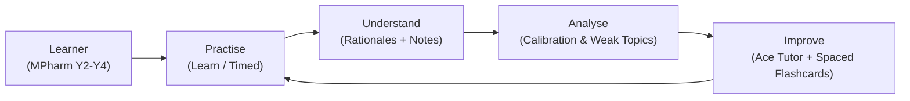
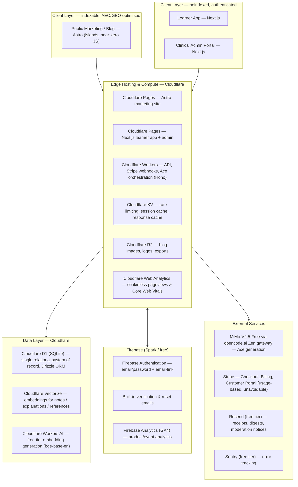

# Implementation Plan: AcePharm UK Pharmacy Revision Platform

> **Document Status**: Draft for Review · Version 3.0 (Firebase + Cloudflare, Astro + Next.js split)
> **Client**: Takween Centre UK Ltd
> **Audience Target**: UK MPharm Students (Years 2–4), Foundation Trainees, and GPhC Candidates
> **Companion References**: `AcePharm-Developer-Brief-v2.1.docx`, `AcePharm-Website-Copy-v2.0.docx`, `acepharm-prototype-vision.html`, `AcePharm-Implementation-Plan-v3.0-Firebase-Cloudflare.pdf` (styled version of this document)
> **Supersedes**: This plan's own v2.1 revision (Next.js/Vercel/PostgreSQL/Prisma/Auth.js). See Section 2 for why.

---

## 1. Executive Overview & What Changed From v2.1

AcePharm is a subscription revision platform for UK MPharm students (Years 2–4), foundation trainees and GPhC candidates: curriculum-mapped practice questions, option-by-option clinical rationales, honest first-attempt-vs-practice analytics, and **Ace** — an AI tutor strictly grounded in AcePharm's own reviewed content. This plan synthesises the Developer Brief v2.1, the Website Copy v2.0, and the interactive HTML prototype into a single build reference, re-platformed onto Firebase and Cloudflare's free tiers, with a split frontend (Astro + Next.js) engineered for search and AI answer-engine visibility.

> [!IMPORTANT]
> **What this revision changes.** The original v2.1 plan specified Next.js on Vercel, managed PostgreSQL + pgvector (UK/EU), Prisma, and Auth.js. That stack is technically sound but carries real monthly cost from day one — a managed EU Postgres instance capable of production traffic and Vercel Pro hosting typically run **£40–£120/month** before a single subscriber signs up. This version keeps every product requirement, data rule and UI/UX decision from the Developer Brief unchanged, and re-derives only the **infrastructure, frontend-rendering and AI-provider** layers: infrastructure moves to Cloudflare's and Firebase's free tiers, the public marketing site moves to Astro for SEO/AEO/GEO, and Ace's generation model moves from Anthropic Claude to **MiMo-V2.5 Free**, served through the opencode.ai Zen gateway's OpenAI-compatible endpoint. Target: **£0 fixed infrastructure cost**, and potentially £0 AI generation cost, through MVP launch and early growth — see Section 5's model-swap caveat before treating that second £0 as guaranteed. The one cost that is certain regardless of provider choices is Stripe's transaction fees (self-funding, taken from revenue).

### 1.1 Product model (unchanged)

| Tier | Price | Allowance & Features | Ace Access |
| :--- | :--- | :--- | :--- |
| **Explorer (Free)** | £0/month | 30 questions/month, resets on signup anniversary. Permanent — not a trial, no card required. | ❌ Disabled |
| **Monthly Pro** | £4.99/month | Unlimited questions, full analytics, weak-area generator, spaced repetition, consultation simulator, timed sessions. | ✅ Full |
| **Yearly Pro** | £49.99/year | Identical features to Monthly Pro (saves £9.89/year). Exact proration shown on upgrade. | ✅ Full |

Per the brief's Non-Negotiable #8: monthly and yearly must never differ in feature set — only in billing cadence and price.

### 1.2 The core loop



### 1.3 System components

1. **Public Marketing & Content Hub** — built in **Astro** for search and AI-answer-engine visibility: transparent pricing, editorial standards, and a database-backed blog, served as close to zero-JS HTML as the design allows. Noindexed application shell kept entirely separate. See Section 14.
2. **Learner Application** — Next.js, mobile-first session builder, question engine, explanation reader, spaced-repetition flashcards and progress dashboard — the single most polished surface in the product per the brief.
3. **Clinical Admin Portal** — Next.js, authoring, multi-stage review (clinical / educational / editorial), curriculum manager, spreadsheet importer, AI oversight queues.
4. **Ace — the AI Layer** — retrieval-augmented tutor grounded exclusively in AcePharm's reviewed explanations, subtopic notes and reference library — never trained-data recall. Never publishes; never diagnoses.

---

## 2. Architecture Decision — Why Firebase + Cloudflare

The Developer Brief's own stack rule (Section 3.1) explicitly permits substitution: *"if you are not fluent in something here, say so before starting and propose the equivalent you know well… do not switch silently mid-build."* This section documents that substitution formally.

### 2.1 Guiding principle: one system of record

Firebase and Cloudflare each offer a database (Firestore, and D1/KV respectively). Running both would create a split-brain data model — exactly the kind of "invisible until it breaks" trap the brief warns about repeatedly (dual-store attempts, secondary-topic counting). To avoid that, **Firebase's role is scoped to Authentication only.** Every other stateful concern — users, questions, attempts, sessions, subscriptions, Ace threads, embeddings — lives in one place: Cloudflare, primarily D1.

**Why Firebase Authentication:**
- Free on the Spark plan for unlimited email/password and email-link ("magic link") sign-in — no cap that forces an upgrade as users grow.
- Built-in, no-cost transactional emails for verification and password reset (brand-customisable templates), removing two of Resend's heaviest-volume flows.
- Handles password hashing, session/ID-token issuance, and brute-force protection — no custom Argon2/bcrypt infrastructure to maintain.
- Firebase Admin SDK verifies ID tokens inside a Cloudflare Worker via standard JWT/JWKS verification — no dependency on Firebase's own compute (Cloud Functions), so the Spark free plan is sufficient indefinitely.

**Why Cloudflare for everything else:**
- **D1** — serverless SQLite, genuinely free at meaningful scale, with a relational model well suited to the brief's dual-store, secondary-topic and cohort-analytics requirements.
- **Vectorize** — purpose-built vector database, replacing pgvector without needing Postgres at all.
- **Workers** — 100,000 requests/day free compute for all API/business logic and Stripe/Ace orchestration.
- **Pages** — unlimited bandwidth static/SSR hosting, with git-integrated preview deployments matching the brief's staging requirement.
- **R2** — zero egress-fee object storage for blog images, logos and exports.

> [!NOTE]
> **Decision recorded.** Firebase = identity only. Cloudflare D1 = single relational system of record. Cloudflare Vectorize = retrieval index for Ace. This keeps the architecture auditable against one database for every acceptance criterion in the brief that depends on query correctness (first-attempt accuracy, category coverage, recommendation logic).

### 2.2 What stays identical to the Developer Brief

Everything that is a *product* decision rather than a *hosting* decision is unchanged: the dual-store attempt rule, the 26 non-negotiables, the Ace governing principle, the design tokens, the copy document, the review workflow, the accessibility target, and all seven milestone acceptance criteria. Only the "Technology Decisions" table, the schema's physical implementation, and the public-site rendering layer change.

### 2.3 GDPR / data-residency note — flagged for client sign-off

> [!WARNING]
> The brief requires the database to sit in the UK or EU, explicitly not the US. Cloudflare D1 supports a **location hint** that pins the primary database instance to Western Europe (`weur`) — this satisfies the requirement for all substantive learner data (attempts, profiles, questions, Ace threads), since D1 is the single system of record. Firebase Authentication's underlying identity store is part of Google's global infrastructure and is *not fully region-pinned* the way a dedicated EU Postgres instance would be, though Google is a certified participant in the EU–US Data Privacy Framework, which provides a lawful transfer mechanism. Because Firebase Auth only ever holds an email address and a password hash — the minimum inherent to any authentication provider — the practical exposure is narrow, but this should be stated plainly in the Privacy Policy and confirmed with the client's legal/compliance sign-off before launch, per Milestone 7's legal-pages requirement. The same sign-off should cover Google Analytics 4 (Section 3.1), which carries a similar data-residency profile and a materially larger volume of personal usage data than authentication alone.

### 2.4 Frontend split for SEO/AEO/GEO — Astro + Next.js

The brief already treats the public site and the learner application as separate SEO concerns: Section 5.8 requires the marketing pages to be server-rendered and fully indexed, while the learner application and admin portal are explicitly **noindexed**. That existing boundary is the natural seam for a second substitution: the public marketing site and blog are built in **Astro** rather than Next.js, while the learner application and admin portal stay on **Next.js App Router** as already specified. Both deploy to Cloudflare Pages and share the same D1/Vectorize/Workers/Firebase backend — only the rendering layer for the public-facing pages changes.

**Why Astro for the public site:**
- Ships zero JavaScript by default; pages are readable as plain HTML without executing a script — which is precisely what most AI answer-engine crawlers (GPTBot, ClaudeBot, PerplexityBot, Google-Extended) either require or strongly prefer, since many do not fully render client-side JavaScript.
- Islands architecture keeps genuinely interactive elements (pricing toggle, FAQ accordion, the hero product visual) hydrated selectively, without hydrating the whole page — the fastest possible Core Web Vitals for the pages Google and AI engines actually rank and cite.
- First-class `@astrojs/cloudflare` adapter — no change to the Cloudflare-first hosting decision in Section 3.
- Content collections map cleanly onto the blog and the Website Copy document's page-by-page structure, keeping copy verbatim and version-controlled.

**Why Next.js stays for the app:**
- The learner application and admin portal are stateful, authenticated, and interaction-heavy (session builder, streaming Ace chat, dual-store attempt writes) — exactly what Astro is not optimised for.
- Both surfaces are noindexed already, so there is no SEO/AEO/GEO benefit to moving them off Next.js — only cost.
- Server Actions and Server Components remain the right fit for authenticated mutations against D1 via Workers.

> [!NOTE]
> **Trade-off, stated plainly.** This is two frontend codebases and two build pipelines instead of one. It is mitigated by sharing a single design-tokens/Tailwind config package and a small shared UI-primitives package (buttons, pills, cards) between both projects, so the public site and the app never visually drift from the prototype's tokens. The alternative — one Next.js codebase for everything — is simpler to maintain but measurably weaker for AEO/GEO on the pages where citation and ranking actually matter. Full detail in Section 14.

---

## 3. System Architecture & Technology Stack



### 3.1 Technology decisions

| Layer | Selection | Tier | Rationale |
| :--- | :--- | :--- | :--- |
| Marketing/blog framework | Astro 4+, islands architecture, strict TypeScript | Free | New in this revision. Near-zero client JS by default — see Section 14. |
| Marketing/blog hosting | Cloudflare Pages (`@astrojs/cloudflare`) | Free | Unlimited bandwidth, 500 builds/month, git-integrated preview URLs. |
| App/admin framework | Next.js 14+ (App Router), strict TypeScript | Free | Unchanged from v2.1, scoped to the noindexed learner app and admin portal. |
| App/admin hosting | Cloudflare Pages (`@cloudflare/next-on-pages`) | Free | Unlimited bandwidth, 500 builds/month, git-integrated preview URLs — replaces Vercel. |
| API / business logic | Cloudflare Workers, Hono framework | Free | 100,000 requests/day free. Hosts Stripe webhooks, Ace RAG orchestration, admin mutations. |
| Database | Cloudflare D1 (SQLite), region-pinned to Western Europe | Free | 5GB storage, 5M rows read/day, 100K rows written/day free. Replaces managed Postgres. |
| ORM | Drizzle ORM | Free | First-class D1 driver, type-safe, SQL-first. |
| Vector search | Cloudflare Vectorize | Free | Purpose-built vector index for Ace's RAG retrieval — replaces pgvector. |
| Embeddings model | Workers AI `@cf/baai/bge-base-en-v1.5` | Free | ~10,000 neurons/day free allocation. Kept separate from the generation model so a future provider swap for generation never touches embeddings. |
| Object storage | Cloudflare R2 | Free | 10GB storage, zero egress fees. |
| Cache / rate limiting | Cloudflare KV + Workers | Free | 100K reads / 1K writes per day free. Sliding-window counters for auth and AI endpoints. |
| Authentication | Firebase Authentication (Spark plan) | Free | Unlimited email/password + email-link sign-in. ID tokens verified inside Workers via JWKS. |
| Payments | Stripe — Checkout, Billing, Customer Portal, Webhooks | Usage-based | Unchanged. Transaction-fee funded; webhook endpoint runs on a Worker. |
| AI LLM provider | **MiMo-V2.5 Free** (`mimo-v2.5-free`) via the **opencode.ai Zen gateway**, `https://opencode.ai/zen/v1/chat/completions`, OpenAI-compatible | Free tier (third-party) | Called from a Worker via `@ai-sdk/openai-compatible`'s `createOpenAICompatible()`, pointed at the Zen base URL. The API key is bound as a Worker secret (`env.ZEN_API_KEY` via `wrangler secret put`) — never hardcoded or committed. See Section 5's caveat: this replaces Anthropic Claude and needs its own evaluation pass, not an assumed drop-in. |
| Transactional email | Firebase (verify/reset) + Resend (everything else) | Free tier | Resend free tier: 3,000 emails/month, 100/day. |
| Product analytics | Google Analytics 4, via the Firebase Analytics SDK | Free | Native to the Firebase project already provisioned for Authentication — no new vendor, no new account. Covers the custom event tracking (signups, sessions, questions answered, Ace usage) the brief's analytics requirements call for. See the GDPR caveat in Section 2.3. |
| Site analytics | Cloudflare Web Analytics | Free | Cookieless pageview and Core Web Vitals beacon, native to the Cloudflare zone already in use for Pages. Complements GA4; does not do custom event tracking on its own. |
| Error tracking | Sentry Developer plan | Free tier | 5,000 errors/month free. Kept — no native Cloudflare/Firebase equivalent covers browser-side exception tracking with grouping and alerting; Cloudflare Workers Logs (below) covers the API side only. |
| Server-side observability | Cloudflare Workers Logs (built-in) | Free tier | Native request/exception logging for the Workers API layer, no separate account. Complements, does not replace, Sentry's frontend coverage. |
| CI/CD | Cloudflare Pages git integration + GitHub Actions | Free | Actions runs D1 migrations and Vectorize re-indexing on merge to main; builds both Pages projects. |

> [!WARNING]
> **One item that may need a paid step.** Cloudflare's free plan includes only a limited allowance of custom WAF rate-limiting rules (verify current allowance before build). Rate limiting for login, registration, password reset, question reporting and every Ace endpoint is implemented at the application layer using Worker + KV sliding-window counters instead, which is free regardless of the WAF rule allowance. Cloudflare's managed bot-fight mode / advanced WAF rules sit on the Pro plan (~£20/month) — an optional hardening step, not a launch blocker.

> [!WARNING]
> **GA4's data residency is weaker than PostHog EU was.** The Developer Brief specified "PostHog, EU region" as a deliberate GDPR-alignment choice. Google Analytics 4 processes data through Google's global infrastructure rather than an EU-pinned region, and standard GA4 has previously been flagged by several EU data protection authorities on exactly this point. This is a genuine trade-off for the £0-cost, no-new-vendor benefit, not a free upgrade — it must be disclosed plainly in the Privacy Policy (Section 12, Milestone 7) and confirmed with the client's legal/compliance sign-off alongside the Firebase Authentication note in Section 2.3. If the client's compliance posture won't accept it, the fallback is PostHog Cloud EU as originally specified — swapping back is a small, isolated change since analytics calls are already centralised behind a thin tracking wrapper (see the runbook, Milestone 1).

---

## 4. Data Architecture on Cloudflare D1

D1 is SQLite, not Postgres — the schema below preserves every field and rule from the Developer Brief's Section 4 while adapting the physical types. Nothing in Section 5's rules (dual-store, secondary-topic counting, numeric metadata) changes; only column types and the absence of native enums/arrays/vectors change how they're expressed.

### 4.1 SQLite adaptation rules

| Postgres/Prisma concept (v2.1) | D1/Drizzle equivalent (v3.0) |
| :--- | :--- |
| UUID primary key, DB-generated | `TEXT` primary key, generated in the Worker via `crypto.randomUUID()` before insert |
| Native `ENUM` type | `TEXT` column with a SQLite `CHECK` constraint, mirrored as a Drizzle/TypeScript union type |
| `JSON` array column (e.g. secondary subtopics) | `TEXT` column storing JSON, via Drizzle's `json()` column helper |
| `TIMESTAMP` | `INTEGER` (Unix epoch ms) via Drizzle's `integer({mode:'timestamp'})` |
| `pgvector` embedding column + cosine search | Embedding lives in **Cloudflare Vectorize**, keyed by the same id as the D1 `content_chunks` row it describes |
| CITEXT (case-insensitive email) | `TEXT` with a `UNIQUE` index on a lower-cased column, enforced by app-layer normalisation on write |

> [!IMPORTANT]
> **The dual-store rule is unchanged and non-negotiable.** Learner answers are still persisted across two distinct tables: `question_first_attempts` (permanent, immutable, never touched by a delete) and `question_attempts` (the working, user-clearable practice record). This is Non-Negotiable Rule #1 in the brief and the single most commonly botched part of a platform like this — the SQLite migration changes nothing about it.

### 4.2 Entity model (D1 / Drizzle)

#### Identity & profiles
- `users` — id · firebase_uid (unique, links to Firebase Auth) · email (unique, lower-cased) · email_verified_at · first_name · role (CHECK: student / author / clinical_reviewer / educational_reviewer / copy_editor / content_lead / support_agent / finance_admin / marketing_editor / super_admin) · status (CHECK: active / suspended / pending_deletion / deleted) · deletion_requested_at · timezone (default Europe/London) · marketing_opt_in (default false) · created_at · updated_at · last_login_at. Password hashing is delegated entirely to Firebase Authentication — `users` holds no password field; `firebase_uid` is the join key.
- `user_profiles` — user_id (FK) · stage (year_2 / year_3 / year_4 / foundation_trainee / other) · primary_goal · assessment_date · daily_question_target (default 20) · university_id (FK) · show_confidence_prompt (default true) · hide_options_by_default (default false) · show_difficulty_labels (default true) — all nullable; every onboarding step is skippable.
- `universities` — id · name · email_domain · active — seeded with the ~30 UK schools of pharmacy.

#### Curriculum & content
- `pathways` → `categories` → `subtopics` → `subtopic_notes` (one set per subtopic, shared by every question beneath it; tables rendered in a horizontally scrollable container, never squashed on mobile).
- `content_chunks` — id · source_type (subtopic_note / explanation / reference) · source_id · chunk_index · content_text · token_count · vectorize_id · updated_at. `vectorize_id` points into the Vectorize index; the embedding itself never lives in D1.

#### Question bank & validation
- `questions` — id · public_id (e.g. `ACP-CV-0012`) · version · status (idea / draft / awaiting_clinical_review / changes_requested / awaiting_editorial_review / approved / scheduled / published / update_required / suspended / archived) · pathway_id · primary_subtopic_id · difficulty (easy / medium / hard) · question_type (sba / emq / calculation) · sector (community / hospital / gp / any) · learning_objective · origin (human / ai_drafted) · generated_by_thread_id · generation_prompt · published_at · next_review_at · created_at · updated_at.
- `question_secondary_subtopics` — question_id · subtopic_id. **One primary, any number of secondary.** Filtering by a subtopic returns questions where it is primary or secondary; category-progress counting uses primary only.
- `question_content` — question_id · stem · lead_in · numeric_answer · numeric_tolerance · numeric_unit · decimal_places · calculator_allowed. Populated for every calculation question at import time even though entry stays multiple-choice for now.
- `question_options` — id · question_id · label (A–E) · content · is_correct · rationale · sort_order. Every option — including the correct one — requires a rationale.
- `question_explanations` · `question_references` · `references` (with `link_status`: ok / broken / superseded) · `question_versions` · `question_governance` (author, clinical reviewer, educational reviewer, copy editor, approval timestamp, conflict-of-interest flag).

#### Learner activity — the dual store
- `question_first_attempts` *(permanent, immutable)* — id · user_id · question_id · question_version · selected_option_id · is_correct · confidence (low / medium / high, nullable) · time_taken_seconds · mode (learn / timed) · answered_at.
- `question_attempts` *(working, user-clearable)* — every field above plus session_id · attempt_number · explanation_opened · due_for_review_at. A category reset deletes this table's rows for that category and never touches `question_first_attempts`.
- `sessions` · `bookmarks` · `notes` (standalone-capable, nullable question_id) · `question_reports` (question id, version, user, session and timestamp captured automatically).

#### The Ace layer
- `ace_threads` — scoped to a context_type (question / dashboard / planner / calculation / simulator); a new thread starts per question.
- `ace_messages` — role · content · intent · retrieved_chunk_ids (JSON) · citations (JSON) · model · prompt_tokens · completion_tokens · latency_ms · cost_pence · flagged · created_at.
- `ace_usage` · `flashcards` (SM-2 fields: interval_days, ease, due_at, reviews, lapses) · `revision_plans` + `revision_plan_days` · `simulator_scenarios` + `simulator_attempts`.

#### Subscriptions, access & audit
- `subscriptions` · `free_tier_usage` (30 questions/month, resets on account-creation anniversary) · `access_grants` (every manual access change logged with a required reason) · `audit_log` (append-only) · `notifications` · `blog_posts` · `support_tickets` · `feature_flags`.

---

## 5. The Ace AI Layer on Cloudflare Vectorize

> [!IMPORTANT]
> **The governing principle — unchanged from the brief.** Ace is grounded, not generative. Every response is produced from AcePharm's own reviewed content — question explanations, option rationales, subtopic notes and the reference library — never from the model's training data. This principle does not depend on which model sits behind it, but it does depend on that model reliably following the grounding-and-refusal instruction — see 5.4 below.

> [!WARNING]
> **Model swap: Anthropic Claude → MiMo-V2.5 Free.** Generation now runs on **MiMo-V2.5 Free**, served through the **opencode.ai Zen gateway** at `https://opencode.ai/zen/v1/chat/completions`, an OpenAI-compatible endpoint integrated via `@ai-sdk/openai-compatible`. This is a genuine model swap, not a hosting change — MiMo-V2.5's instruction-following, refusal behaviour and clinical-register writing have not been evaluated to the standard Claude Sonnet was assumed to meet in v2.1/v3.0. Do not assume behavioural parity. Section 5.4 covers what must be re-verified before this is trusted in production.

### 5.1 Retrieval pipeline on the free tier

1. **Chunk on publish** — when a question, explanation or subtopic note is published, a Worker splits it into `content_chunks` and writes metadata rows to D1.
2. **Embed for free** — Workers AI (`@cf/baai/bge-base-en-v1.5`) generates the embedding, no external embedding API spend. Unaffected by the generation-model swap.
3. **Index in Vectorize** — the vector is upserted into a Vectorize index keyed by the D1 chunk id.
4. **Retrieve on each Ace turn** — a Worker embeds the learner's query, queries Vectorize for nearest chunks, hydrates matched content from D1.
5. **Generate with MiMo-V2.5** — retrieved chunks placed in the prompt with an explicit instruction to answer only from them, and to refuse plainly when coverage is missing. The Worker calls the Zen gateway via `@ai-sdk/openai-compatible`'s `streamText()`, and the response streams back to the client exactly as it did with Claude.
6. **Log everything** — `retrieved_chunk_ids`, citations, tokens, latency, `cost_pence` (0 while the gateway's free tier holds) and the **model identifier** (`mimo-v2.5-free`) written to `ace_messages` before the response is considered complete. Recording the model per message matters more now than it did with a single fixed provider, since a future fallback or rotation will otherwise be invisible in the data.

### 5.2 Ace surfaces (from the prototype and brief, unchanged)

| Surface | Behaviour |
| :--- | :--- |
| Ask Ace panel | Collapsed below every explanation by default. Quick prompts: `simpler`, `whynot`, `similar`, `test`, `exam`, `steps` (calculations only). Free text accepted; every message carries a citation. |
| Highlight-to-ask | Selecting text surfaces a floating control that opens the panel with the selection quoted — works via mobile selection handles. |
| Revision planner | Seven-day plan from subtopic-level first-attempt accuracy, unseen volume, assessment date and actual session length. Always includes a rest day and at least one spaced-review day. |
| Weekly insight | One cached paragraph, generated on a schedule not on page load. Leads with "confidently incorrect" answers whenever they exist. |
| Calculation coach | Identifies which line of the learner's working broke, grounded in the stored `calculation_working` field. Accepts valid alternative methods. |
| AI-drafted questions | Created as `draft` / `ai_drafted`, enters the same review workflow as human content, never visible to learners pre-approval. Generator ≠ approver, enforced at the D1 layer. |
| Consultation simulator | One scenario ships (new inhaler counselling, four exchanges, six-point rubric) as a database row, not a hardcoded object. |

### 5.3 Safety & cost controls

**Safety** (brief Section 6.10): no patient-specific advice (declines, directs to BNF) · no dosing from memory · citations on every response · prompt injection defence (learner input untrusted, retrieved content trusted, kept structurally separate) · 50+ case evaluation set run before launch and after every prompt change.

**Cost** (Cloudflare-specific optimisations): cache identical quick-prompt + question pairs in KV at question-and-intent level, not per learner · weekly insight generated on a cron Worker trigger, never on page load · retrieve narrowly, never whole subtopic notes per turn · `cost_pence` tracked per message from day one (expected £0 while the Zen gateway's free tier holds) · 20-second timeout with retry · if the AI provider is unavailable, the panel degrades gracefully — no core learning-loop feature may block on an AI call.

### 5.4 What must be re-verified before MiMo-V2.5 is trusted with clinical grounding

Swapping the generation model is not a config change to wave through — the brief's Non-Negotiables 21–24 (Ace answers only from retrieved content, never publishes, always cites, never gives patient-specific advice) were written assuming a model with strong, reliable instruction-following. Before this model is used with real learners:

- **Re-run the full 50+ case evaluation suite** (Section 11.2) specifically against `mimo-v2.5-free` — a pass rate under Claude does not transfer. Pay particular attention to the refusal tests: a weaker model is more likely to "helpfully" answer from training data when retrieval is thin, which is precisely the failure mode the brief calls out as the one that "looks fine in testing and is wrong in the field."
- **Check clinical register and British English compliance** (Section 10) — the model's default writing style has not been validated against the brand-voice and banned-phrases rules and may need a firmer system prompt or post-processing pass.
- **Confirm streaming and function-calling compatibility** with `@ai-sdk/openai-compatible` against the Zen gateway specifically — OpenAI-compatible does not always mean feature-complete; verify streaming, stop sequences and token-usage reporting behave as the cost-tracking pipeline in `ace_messages` expects.
- **Design the integration provider-agnostically from day one**: wrap the model call behind a single internal `generateAceResponse()` service so that swapping back to Claude, to OpenAI, or to a different Zen model is a one-line configuration change, not a rewrite. This was already good practice; it is now load-bearing.

> [!WARNING]
> **Do not skip this section to save time.** A free model that occasionally ignores its grounding instructions is a worse outcome for AcePharm than no Ace at all, given Non-Negotiable #21 and the clinical-safety framing in Section 6.10 of the brief. If the evaluation suite shows materially worse refusal behaviour than the original Claude baseline, the recommended fallback is to keep MiMo-V2.5 for cost-insensitive, low-risk intents (e.g. `simpler`, `test`) and route higher-risk intents (`whynot`, free-text patient-adjacent queries) to a stronger model — the provider-agnostic wrapper above makes this a routing decision, not an architecture change.

---

## 6. Free-Tier Ceilings, Costs & Scaling Triggers

Free tiers are not unlimited. **Verify current limits against each provider's pricing page before contract sign-off, as free-tier terms change.**

| Service | Free ceiling | Comfortably supports | First paid step |
| :--- | :--- | :--- | :--- |
| Cloudflare Pages | Unlimited bandwidth, 500 builds/mo | Any realistic traffic pre-Series A | No paid tier needed for hosting itself |
| Cloudflare Workers | 100,000 requests/day | ~500–1,500 daily active learners at typical request rates | Workers Paid, $5/mo base + $0.30/million requests beyond free |
| Cloudflare D1 | 5GB storage · 5M rows read/day · 100K rows written/day | Thousands of DAU answering dozens of questions each — writes/day is the ceiling to watch first | D1 usage pricing beyond free allowance — cheaper than managed Postgres at equivalent load |
| Cloudflare Vectorize | Free allocation of stored + queried dimensions/month | The full 2,000-question target bank plus notes and references, comfortably | Usage-based pricing beyond allocation |
| Cloudflare R2 | 10GB storage, zero egress | Blog imagery, logos, export files for years of content growth | $0.015/GB-month beyond 10GB — no egress charge ever |
| Cloudflare KV | 100K reads/day, 1K writes/day | Rate-limit counters and response caching at moderate traffic | KV usage pricing beyond free allowance |
| Workers AI (embeddings) | ~10,000 neurons/day | Ongoing content publishing and re-indexing at a sustainable pace | Usage-based Workers AI pricing beyond allocation |
| Firebase Authentication (Spark) | Unlimited email/password + email-link | No practical ceiling for this project's auth methods | N/A — stays free at any scale |
| Resend | 3,000 emails/month, 100/day | Early hundreds of active subscribers | Paid plans start around $20/month |
| Google Analytics 4 (Firebase) | Free GA4 property: up to 500 distinct event names, no published event-volume cap | Comfortably covers the full analytics event list at any realistic MVP-to-growth volume | GA4 360 (enterprise, paid) only becomes relevant at a scale far beyond this product's near-term trajectory |
| Cloudflare Web Analytics | Free, no published volume cap | Any realistic traffic | No paid tier — stays free |
| Sentry Developer | 5,000 errors/month, 1 seat | A well-behaved production app | Team plan, ~$26/month, for more seats |
| opencode.ai Zen gateway (MiMo-V2.5 Free) | Advertised as free; exact rate limits are third-party-managed and not contractually guaranteed | Ace generation at low-to-moderate volume, pending real-world rate-limit testing | If the free tier is throttled, discontinued, or fails the evaluation in Section 5.4, fall back to a paid model on the same OpenAI-compatible interface (Zen's paid tiers, or Anthropic Claude) — a config change behind the provider-agnostic wrapper, not a rewrite |

> [!NOTE]
> **Net effect.** Every layer of hosting, database, vector search, storage, caching and authentication runs at **£0/month** through MVP launch and a meaningful runway of organic growth. Ace generation itself is also currently £0 via the Zen gateway's free tier — but unlike Cloudflare's and Firebase's published free tiers, this one is a smaller third-party service with no long-term guarantee, so it should be treated as a cost-saving bonus, not a load-bearing assumption. Stripe's transaction fees are the one cost that is certain regardless of any provider choice, and it scales with revenue rather than being fixed overhead.

---

## 7. Critical Engineering Rules & The 26 Non-Negotiables

> [!WARNING]
> **The 7 architectural traps to guard against**:
> 1. **Never combine attempt stores** — a single-table design corrupts first-attempt calibration the moment a user resets practice history.
> 2. **Secondary topics filter only** — never double-count toward category coverage totals.
> 3. **Capture numeric metadata now** — target, tolerance, units, decimal places stored at import so free-text calculation entry can ship later without re-authoring 2,000+ questions.
> 4. **Multi-sensory feedback** — correct/incorrect needs a border, an icon, and explicit text — never colour alone (WCAG 2.2 AA).
> 5. **Uninterrupted completion** — hitting the free limit on question 30 still shows the full question 30 explanation before any upgrade prompt.
> 6. **Strict RAG refusal** — Ace answers solely from retrieved chunk context; missing coverage triggers a clear refusal, never a hallucinated inference.
> 7. **Human-in-the-loop gate** — AI-generated questions save as draft and require human reviewer sign-off before entering active pools, enforced in the database.

### 7.1 The 26 non-negotiable rules (Developer Brief Section 10)

| # | Rule |
| :-: | :--- |
| 1 | First-attempt performance stays permanently distinguishable from repeated attempts — two stores, first attempts never deleted |
| 2 | Confidence is captured before submission, never after |
| 3 | Explanations analyse every incorrect option, not just the correct answer |
| 4 | Every published question has an owner and a version history |
| 5 | Nothing becomes publicly visible because it was imported |
| 6 | Every analytics view ends with a useful next action |
| 7 | Upgrade prompts never interrupt active learning |
| 8 | Monthly and yearly contain identical features |
| 9 | Cancellation is available online without obstacles |
| 10 | Streaks reward meaningful revision, not opening the application |
| 11 | Mobile question answering is a primary experience |
| 12 | WCAG 2.2 AA is the target |
| 13 | Non-essential cookies stay off until consent |
| 14 | Marketing animation never compromises application speed |
| 15 | No fabricated testimonials, statistics or endorsements |
| 16 | The platform never claims to guarantee exam success |
| 17 | No implied endorsement by the GPhC, NHS, NICE, universities or any other body |
| 18 | The question interface is the most polished area of the product |
| 19 | Avoid the word "mastered" in progress language |
| 20 | Learner data is never deleted on cancellation — locked, not destroyed |
| 21 | Ace answers only from retrieved AcePharm content, never from training data |
| 22 | Ace never publishes — full human review, labelled, generator separated from approver |
| 23 | Every Ace response carries a citation |
| 24 | Ace never gives patient-specific advice |
| 25 | No core feature blocks on an AI call |
| 26 | Flashcards are built from pharmacist-written learning points, not content Ace invents |

### 7.2 Progress metrics — keep these distinct

| Metric | Definition | Source |
| :--- | :--- | :--- |
| First-attempt accuracy | Correct on the very first attempt ever | `question_first_attempts` |
| Practice accuracy | Correct across all attempts | `question_attempts` |
| Repeat accuracy | Correct on attempts after the first | `question_attempts`, attempt_number > 1 |
| Confidence calibration | Stated confidence vs actual correctness | Both |
| Coverage | % of available questions in a subtopic attempted at least once | `question_first_attempts` |

Status labels, in order: Not started → First pass → Needs attention → Developing → Secure → Due for review. Never "mastered" — the methodology cannot defend the claim.

---

## 8. Phased Implementation Milestones

```mermaid
gantt
    title AcePharm Engineering Roadmap
    dateFormat  YYYY-MM-DD
    section Phase 1
    M1: Foundations & Infrastructure        :m1, 2026-09-01, 10d
    M2: Content Pipeline & Ingestion        :m2, after m1, 8d
    section Phase 2
    M3: Question Engine & Session Flow      :m3, after m2, 14d
    M4: Dashboard, Analytics & Recs         :m4, after m3, 10d
    section Phase 3
    M5: The Ace AI Layer & RAG Architecture :m5, after m4, 14d
    M6: Public Site (Astro), SEO & Stripe   :m6, after m5, 10d
    section Phase 4
    M7: Hardening, a11y & Production Launch :m7, after m6, 8d
```

Seven milestones, unchanged in scope and acceptance criteria from the Developer Brief — updated below only where the Cloudflare/Firebase/Astro stack changes the concrete deliverable. Each milestone ends with a Cloudflare Pages preview deployment the client reviews before the next begins.

### Milestone 1 — Foundations & Infrastructure
Cloudflare account, two Pages projects (Astro marketing site, Next.js learner app/admin), Workers project (Hono), D1 database with location hint `weur`, Vectorize index, R2 buckets, KV namespaces — all provisioned via Wrangler and checked into `wrangler.toml`. Firebase project created, Authentication enabled (email/password + email-link), Admin SDK wired into a Worker for token verification. Drizzle schema covering every Milestone 1–7 entity, including deferred-feature fields. A shared design-tokens/Tailwind config package published for both frontend projects. GitHub Actions pipeline running D1 migrations on merge, building both Pages projects independently.

**Acceptance**: account created via Firebase, verified, and logged in on the Pages preview. A non-admin visiting `/admin` returns HTTP 403, enforced inside the Worker, not just hidden in the UI. D1 migrations run cleanly from empty.

### Milestone 2 — Content Pipeline & Seed Ingestion
Curriculum manager, subtopic notes editor, SBA/calculation question editor with mandatory per-option rationales, full review-status state machine, spreadsheet importer with a readable pre-write validation report, R2-backed image uploads. Import and publish the 135 seed questions across 19 categories — as drafts first, publishing always a separate deliberate action per question.

**Acceptance**: the complete 135-question seed bank imported through the importer, reviewed and published on staging. Form validation blocks any question lacking individual option rationales.

### Milestone 3 — The Question Engine & Session Experience
Session builder; question screen (desktop and mobile) with confidence-before-submission, optimistic-UI answer feedback under 300ms perceived, hide-options mode, keyboard shortcuts respecting text-field focus, bookmarking, notes, reporting; dual-store writes via a Worker transaction; session summary with review grid.

**Acceptance**: a 20-question session completes on iOS Safari, Android Chrome and desktop. First-attempt records write once; a category reset clears `question_attempts` for that category while `question_first_attempts` is untouched.

### Milestone 4 — Dashboard, Calibration Analytics & Recommendations
Meaningful-session streak (≥5 questions or ≥10 active minutes), timezone-aware daily goal, the explainable recommendation engine, first-attempt/practice/repeat accuracy split, confidence-calibration matrix, coverage map, weak-area session generator.

**Acceptance**: a new account shows clean guided empty states; an account with 100+ attempts shows a recommendation with a visible, honest reason.

### Milestone 5 — The Ace AI Layer & Vectorize RAG
Chunking pipeline on publish; Workers AI embeddings into Vectorize; Ask Ace panel with quick prompts, free text, streaming and highlight-to-ask; thread scoping and full retrieval/cost logging; weekly insight on a Cron Trigger; revision planner; calculation coach; SM-2 flashcards; AI-drafted questions into the existing review workflow with generator/approver separation enforced at the D1 layer; consultation simulator as a database row; 50+ case evaluation set.

**Acceptance**: Ace answers correctly with citations across all seed subtopics; out-of-coverage and real-patient queries trigger a graceful refusal; the 50+ case evaluation suite passes specifically against `mimo-v2.5-free` (Section 5.4), not only against a prior baseline; with the AI provider disabled, every other part of the product keeps working.

### Milestone 6 — Public Marketing Site (Astro), SEO & Stripe
All public pages built in Astro with verbatim copy from the companion document; database-backed blog (content served through a Worker API from D1, rendered by Astro) with an admin markdown editor in the Next.js admin portal; cookie consent gating Firebase Analytics (GA4) and Cloudflare Web Analytics initialisation; full SEO/AEO/GEO layer per Section 14 — JSON-LD, sitemap, `llms.txt`, AI-crawler robots policy; noindex on the app/admin shells; Stripe Checkout for both plans, webhook handler on a Worker with signature verification and idempotent handling of all five required event types; two-screen in-app cancellation; transactional emails (Firebase for verify/reset, Resend for the rest).

**Acceptance**: full journey verified in Stripe test mode end to end on staging: visitor → free account → 30 questions → limit → checkout → unlimited access → self-service cancellation. Lighthouse 90+ on the homepage.

### Milestone 7 — Hardening, Accessibility & Launch Readiness
Remaining admin (user management, reports queue, support tickets, audit log, AI oversight, cost dashboards); full WCAG 2.2 AA audit; D1 index tuning and load-testing the session-builder filter query under simulated volume; CSP headers and app-layer rate limiting verified on every auth and Ace endpoint; automated daily D1 backup via Wrangler export to R2, with a scripted restore test; production Cloudflare zone, live Stripe keys, monitoring dashboards live.

**Acceptance**: Section 9 launch checklist 100% complete. Zero critical vulnerabilities in an automated security scan. Daily D1 backup restore verified on staging.

---

## 9. Accessibility, Security & Compliance

### 9.1 Accessibility — WCAG 2.2 AA
- [ ] Full keyboard navigation, visible focus states on every interactive element
- [ ] Semantic heading hierarchy, no skipped levels; labelled form controls with linked, specific error messages
- [ ] ARIA live region announces answer results — correct/incorrect never relies on colour alone
- [ ] Text resizes to 200% without loss of function; `prefers-reduced-motion` respected everywhere, including the Ace orb and hero visual
- [ ] Touch targets minimum 44×44px; tables have proper headers and scope
- [ ] No CAPTCHA as the sole authentication route; no auto-playing audio
- [ ] axe-core run in CI; manual keyboard-only and VoiceOver/NVDA pass on the question screen specifically

### 9.2 Security baseline
**Identity & transport**: HTTPS with HSTS at the Cloudflare edge by default · password hashing delegated to Firebase Authentication · Firebase ID tokens verified server-side on every Worker request — a hidden button is never authorisation · CSRF protection on all state-changing routes.

**Application & data**: rate limiting via Worker + KV sliding windows on login, reset, registration, reporting and every Ace endpoint · Stripe webhook signature verification, idempotent handlers · CSP headers set at the Worker/Pages layer · no secrets in the repository — Cloudflare and Firebase secrets stored via Wrangler secrets and environment bindings · admins never see passwords (Firebase-managed, not stored in D1 at all).

### 9.3 Environments
Local (Wrangler dev, local D1 emulation) → Staging (separate D1 database, seeded with the 135 seed questions, password-protected Pages deployment, Stripe test mode, Firebase project in test mode) → Production (region-pinned D1, live Stripe, live Firebase project). Environments are never cross-wired.

---

## 10. Brand Voice & Copy Compliance

The Website Copy document is the source of truth for every string in the product — used verbatim, not paraphrased. The tone rules below are a product decision, not a style preference.

### 10.1 Voice
Intelligent, calm, precise, supportive. Encouraging but never patronising. Plain British English — "organise", "personalised", "analyse", "programme"; "medicines" not "meds"; micrograms written in full, never "mcg" or "µg"; 12-hour clock ("3:00 pm"); dates as "18 September 2027".

### 10.2 Banned phrases and preferred alternatives

| Never write | Write instead |
| :--- | :--- |
| "You failed" | "Not quite. Let's work through it." |
| "You are falling behind" | "This topic needs another look" |
| "Don't lose your streak" / "We miss you!" | "You are building consistency" |
| "Only [X] days left" | "A short session today will keep you on track" |
| "Cardiology accuracy: 57%" (bare figure) | "Cardiovascular is currently your weakest major topic. A 15-question focused session is ready." |
| "Wrong!" / "Mastered" / "Guaranteed" | Never used — see Non-Negotiables 16, 19 |
| "Everything you need to pass" / "Complete curriculum coverage" | Not claimed — coverage shown honestly with a next action |
| Any claim of GPhC / NHS / NICE / university endorsement | Never implied, anywhere in copy or design |
| "AI-powered" as a standalone selling point | State what Ace does, not what it runs on |

> [!WARNING]
> **Deferred features — do not build**: mock exam engine, achievements/badges, university community/leaderboards, student stories/testimonials (no real testimonials exist), homepage statistics counters (no verified figures), extended-matching question UI (schema supports it, UI does not ship), free-text numeric calculation entry (fields captured, input stays multiple-choice), native apps/PWA/offline mode, dark mode (tokens make it a later config change), voice input/output, multiple simulator scenarios, System Status/Roadmap/Careers pages, and social login.

---

## 11. Verification Plan & Quality Assurance

### 11.1 Automated testing matrix
**Unit & integration** (Vitest, incl. `@cloudflare/vitest-pool-workers`): attempt-store isolation · SM-2 interval/ease-factor progression · recommendation engine priority-sorting rules · free-tier 30-question boundary and anniversary reset · D1 migrations run against Miniflare in CI.

**End-to-end** (Playwright, against Pages preview URLs): registration → Firebase verification → onboarding → session → answering flow · timed session countdown, pause, resume, timeout auto-submit · Stripe checkout and webhook entitlement provisioning in test mode · Ace panel opening, prompt sending, streamed rendering, citation display.

### 11.2 AI evaluation suite (50+ cases)
Citation accuracy across core subtopics (cardiovascular, respiratory, mental health, palliative care, renal). Refusal tests: real-patient queries, out-of-curriculum queries, and dosing-from-memory prompts must all trigger the graceful refusal path. Re-run on every system-prompt or retrieval change.

### 11.3 Manual verification checklist
- [ ] Responsive verification on iPhone Safari, Android Chrome, iPad Safari, desktop Chrome/Safari
- [ ] Screen-reader navigation with VoiceOver and NVDA
- [ ] Category practice reset clears `question_attempts` while first-attempt accuracy is unchanged
- [ ] Question and Ace reports appear in the admin moderation queue with auto-attached metadata
- [ ] D1 backup restore drill succeeds on staging before go-live
- [ ] Every banned phrase in Section 10.2 absent from shipped copy — spot-checked against the live build
- [ ] Every classified error state in Section 16.2 verified against the live build — no raw status code, Firebase error code, or provider name reaches the UI

---

## 12. What The Client Must Supply

| Item | Needed by |
| :--- | :--- |
| Final category and subtopic list (client finalising; seed bank covers 19 of ~20–26) | Milestone 2 |
| Seed Question Bank v0.1 (135 questions, 27 subtopics) | Milestone 2 |
| Logo files and favicon | Milestone 1 |
| Domain and DNS access (for Cloudflare zone setup) | Milestone 1 |
| List of UK schools of pharmacy | Milestone 1 |
| opencode.ai Zen gateway API key, stored as the Cloudflare Worker secret `ZEN_API_KEY` — never committed to the repository or written into any document | Milestone 5 |
| Approved consultation scenario script and rubric | Milestone 5 |
| Stripe account (live and test keys) | Milestone 6 |
| Founder bio and About page detail | Milestone 6 |
| Email sending domain verification (for Resend) | Milestone 6 |
| Any initial blog articles | Milestone 6 |
| Terms, Privacy, Cookie Policy, Acceptable Use text — including the Firebase data-residency note in Section 2.3 | Milestone 7 |
| AI Use Policy text | Milestone 7 |

Open items that do not block Milestones 1 or 2: final category count (20–26, client finalising), whether the blog stays database-backed as assumed here, and whether support tickets stay in-house (assumed, Milestone 7) or move to a hosted helpdesk.

---

## 13. Risk Register — Free-Tier Specific

| Risk | Likelihood | Mitigation |
| :--- | :--- | :--- |
| D1's 100,000 writes/day ceiling is reached by attempt-logging at scale | Medium, post-growth | Monitored via a Cloudflare dashboard alert; upgrading to D1 usage-based pricing is a config change, not a re-platform. |
| Firebase Authentication's identity store is not fully EU-region-pinned | Certain (architectural) | Scoped exposure (email + password hash only); documented in Privacy Policy; confirmed with legal sign-off before launch. |
| Cloudflare free-plan WAF rate-limiting allowance is too thin for defence-in-depth | Low | Primary rate limiting implemented at the application layer (Worker + KV); Pro plan (~£20/mo) available as an additive hardening step. |
| Workers AI free embedding allocation is exhausted during a large content re-index | Low, bursty | Re-indexing runs are batched and rate-limited; a one-off overage is inexpensive usage-based spend. |
| Vendor lock-in to Cloudflare's proprietary primitives (D1, Vectorize, KV) | Structural, accepted trade-off | Drizzle's schema layer and the RAG retrieval interface are abstracted behind repository/service modules — a future migration touches the data-access layer only. |
| Team unfamiliarity with Cloudflare Workers/D1 versus the more common Vercel/Postgres pairing | Project-dependent | Per the brief's own override rule: say so before Milestone 1 and propose the equivalent the team knows well. |
| Two frontend codebases (Astro + Next.js) drift apart visually or in copy over time | Medium, maintenance-phase | Shared design-tokens/Tailwind package and shared UI-primitives package are the single source of truth for both; copy stays sourced from the one Website Copy document. |
| MiMo-V2.5's grounding/refusal instruction-following is weaker than Claude's, allowing an occasional hallucinated or ungrounded answer | Unverified — must be tested, not assumed | Full 50+ case evaluation suite (Section 5.4) run against the specific model before launch; provider-agnostic wrapper allows routing higher-risk intents to a stronger fallback model without an architecture change. |
| opencode.ai Zen's free tier for MiMo-V2.5 is throttled, rate-limited unpredictably, or discontinued with little notice | Medium — typical for third-party free tiers | Ace usage and error rates monitored in Sentry from day one; provider-agnostic wrapper makes falling back to a paid Zen tier or another OpenAI-compatible provider a configuration change. |
| The Zen gateway API key is exposed (e.g. pasted into a chat, committed accidentally) | Has already happened once during planning | Store only as a Wrangler secret (`ZEN_API_KEY`), never in source, tickets, or documents; rotate any key that has appeared in plaintext outside a secrets manager. |
| Google Analytics 4's data residency does not meet the client's compliance bar (weaker than the originally specified PostHog EU) | To be confirmed with legal — see Section 2.3 | Analytics calls run through one thin tracking wrapper (runbook, Milestone 1), so falling back to PostHog Cloud EU is an isolated, low-effort change if compliance sign-off requires it. |

---

## 14. AEO/GEO & SEO Strategy — the Astro + Next.js Split

"Search Engine Optimisation" now sits alongside two newer disciplines this plan explicitly targets: **Answer Engine Optimisation (AEO)** — being the source an AI system quotes when a user asks it a direct question — and **Generative Engine Optimisation (GEO)** — being retrieved and cited by generative answer engines such as Google's AI Overviews, Perplexity, and ChatGPT's browsing mode. All three depend on the same underlying property: content that is fully present in the server-rendered HTML, semantically marked up, and reachable without executing JavaScript — which is exactly what the Astro split in Section 2.4 is for.

### 14.1 Why this matters for AcePharm specifically
A meaningful share of a pharmacy student's study questions are exactly the kind AI answer engines are now positioned to answer directly — "what's the breakthrough dose rule for morphine", "when should a lithium level be taken". AcePharm's FAQ, blog and Editorial Standards pages are well suited to being the cited source for that kind of query, provided the content is structured so an answer engine can parse it cleanly and attribute it. This is free distribution that a JS-heavy, client-rendered marketing site would largely forfeit.

### 14.2 Technical implementation

| Element | Implementation |
| :--- | :--- |
| Rendering | Astro static output for pages with no per-user variation (homepage, features, pricing, about, editorial standards, legal); Astro SSR (via the Cloudflare adapter) for the blog index and search, sourced from D1 through the Workers API. |
| Structured data (JSON-LD) | `Organization` on every page · `FAQPage` on the FAQ, driven directly from the copy document's FAQ entries · `Article` on every blog post · `BreadcrumbList` site-wide · `Product`/`Offer` on the pricing page reflecting the two real tiers, never inflated figures. |
| Sitemap & robots | `sitemap.xml` auto-generated by Astro's sitemap integration on every build. `robots.txt` explicitly **allows** known AI crawlers (`GPTBot`, `ClaudeBot`, `PerplexityBot`, `Google-Extended`, `CCBot`, `Applebot-Extended`) on the marketing site and blog, and explicitly **disallows** all crawlers — traditional and AI — on `/app` and `/admin`, reinforcing the existing noindex requirement. |
| `llms.txt` | An emerging, low-cost convention: a plain-text root file summarising what AcePharm is, linking to the highest-value pages (features, pricing, FAQ, editorial standards, key blog posts) in clean Markdown. |
| Semantic structure | One `<h1>` per page, strict heading hierarchy, descriptive link text — already required by the WCAG 2.2 AA target; accessibility and AEO/GEO markup are the same underlying discipline. |
| FAQ-first content | The Website Copy document's FAQ entries are written as direct question-and-answer pairs already — ideal `FAQPage` schema candidates with no rewriting needed. |
| Performance | Astro islands keep LCP under the brief's 2.0s/4G target by default, since almost nothing on a static marketing page needs client JS to paint. |
| Canonicalisation | Canonical URL on every page; blog pagination and filtered views use `rel=canonical` back to the primary article to avoid duplicate-content dilution. |

### 14.3 Editorial guidance for AEO/GEO
- Write blog posts and FAQ answers to stand alone as a complete, quotable answer in the first two or three sentences — the pattern answer engines most reliably extract
- Never let a claim exceed what Section 10's banned-phrases list and Non-Negotiables 15–17 permit — an AI engine repeating an unsupported claim verbatim is a worse outcome than a human reader skimming past it
- Keep review dates and reference citations visible in rendered HTML, not only in a tooltip or a collapsed panel requiring a click — several AEO-relevant crawlers do not interact with the page
- Every published blog post gets a one-paragraph, self-contained summary at the top — this becomes both the meta description and the most likely AI-quoted excerpt

> [!NOTE]
> **What does not change.** The learner application and admin portal remain fully noindexed and disallowed to every crawler class, AI included — non-negotiable behaviour, not a new decision. AEO/GEO is additive to the marketing site only; it does not relax any privacy or access boundary elsewhere in the product.

---

## 15. Step-by-Step Build Runbook

Section 8 gives the scope and acceptance criteria for each milestone. This section gives the literal, ordered sequence of steps to execute them — the checklist a developer follows from an empty repository to production. Steps within a milestone are ordered because later steps depend on earlier ones; milestones themselves stay sequential per Section 8.

### Phase 0 — Prerequisites (before Milestone 1)
1. Confirm accounts exist: Cloudflare, Firebase (Google), GitHub, Stripe (test mode), opencode.ai (Zen gateway), Resend, Sentry. Google Analytics 4 and Cloudflare Web Analytics need no separate account — they activate inside the Firebase project and Cloudflare zone created in Milestone 1.
2. Chase the client for anything needed by Milestone 1 per Section 12: domain/DNS access, logo files and favicon, the list of UK schools of pharmacy.
3. Install local tooling: Node.js LTS, pnpm, Wrangler CLI, Firebase CLI, GitHub CLI.
4. Confirm the GitHub repository and branch protection on `main` (this project already has `takweentutors1/acepharm-uk-pharmacy`).

### Milestone 1 — Foundations & Infrastructure
1. Scaffold the monorepo: `apps/marketing` (Astro), `apps/app` (Next.js learner app + admin), `apps/api` (Cloudflare Worker, Hono), `packages/design-tokens`, `packages/ui` — a pnpm workspace so both frontends share one Tailwind config and UI-primitives package (Section 2.4).
2. `wrangler d1 create acepharm-db --location=weur` and record the database ID in `wrangler.toml`.
3. `wrangler vectorize create acepharm-content --dimensions=768 --metric=cosine` (matching the `bge-base-en-v1.5` output dimension).
4. `wrangler r2 bucket create acepharm-assets` and `wrangler kv namespace create RATE_LIMIT` / `CACHE`.
5. Bind D1, Vectorize, R2 and KV to the `apps/api` Worker in `wrangler.toml`.
6. Create the Firebase project; enable the Email/Password and Email Link (magic link) sign-in providers only, per the brief's "no social login" rule.
7. Generate a Firebase Admin SDK service-account key; store it as a Worker secret (`wrangler secret put FIREBASE_ADMIN_KEY`) — never in source.
8. Write the Drizzle schema covering every entity in Section 4, including deferred-feature fields; run `drizzle-kit generate`, then `wrangler d1 migrations apply acepharm-db` against local and remote.
9. Implement the auth middleware: verify the Firebase ID token via JWKS on every Worker request, resolve `firebase_uid` to a `users` row (creating one on first login).
10. Implement RBAC middleware enforcing the role table from the brief's Section 7.2; confirm a non-admin request to any `/admin` route returns 403 from the Worker itself, not from a hidden UI element.
11. Set up GitHub Actions: lint/typecheck/test on every PR; on merge to `main`, apply D1 migrations, sync Vectorize, and deploy both Pages projects and the Worker.
12. Wire Sentry, Firebase Analytics (GA4) and Cloudflare Web Analytics into both frontends, all calls routed through one thin internal tracking wrapper so the analytics provider is a config change, not a rewrite (mirroring the AI-provider wrapper in Section 5.4). Gate all three behind the (not-yet-live) cookie consent banner so no event fires before consent.
13. Deploy all three projects to a password-protected staging environment.
14. **Acceptance**: register, verify via Firebase, log in on the staging preview; non-admin gets 403 on `/admin`; migrations run cleanly from empty.

### Milestone 2 — Content Pipeline & Seed Ingestion
1. Build the curriculum manager (pathway → category → subtopic CRUD, reorder, archive-without-delete).
2. Build the subtopic notes editor (markdown/table support, horizontally scrollable table wrapper).
3. Build the question editor (stem, lead-in, five options with rationales, all metadata fields from Section 4.3, numeric fields for calculations) with the Section 7.3 validation checklist enforced server-side.
4. Implement the review-status state machine and the three review checklists (clinical, educational, editorial) as real tick-boxes, per Section 7.4.
5. Build the spreadsheet importer: upload → column mapping → full validation pass producing a readable per-row error report → commit valid rows as drafts only.
6. Chase the client for the Seed Question Bank v0.1 and the final category list if not yet received (blocking dependency, Section 12).
7. Import the 135 seed questions through the importer; run them through the review workflow; publish one at a time (never in bulk, per Section 7.4).
8. **Acceptance**: the full 135-question bank is live on staging; the importer and editor both reject any question missing a rationale on any option.

### Milestone 3 — The Question Engine & Session Experience
1. Build the session builder (filters: category, subtopic, status, mode, question count).
2. Build the question screen for desktop and mobile: vignette rendering, pre-submission confidence selector, option selection using border/tint only (no colour before submission), optimistic-UI submit.
3. Implement the dual-store write as a single Worker transaction: check for an existing `question_first_attempts` row for (user, question); write it only if absent, always write `question_attempts`.
4. Build the explanation layout in the fixed section order from the prototype: feedback banner, takeaway point, per-option rationale, subtopic notes disclosure.
5. Implement bookmarking, personal notes (standalone-capable), and the report-a-question modal (auto-attaching question id, version, user, session, timestamp).
6. Implement hide-options-by-default as a read from `user_profiles`, and the on/off confidence prompt setting.
7. Implement keyboard shortcuts (A–E, 1–3, Enter, Space), guarded so they never fire while a text field has focus.
8. Build the session summary (score, time per question, review grid, jump-to-weak-topic).
9. Implement category reset: delete `question_attempts` for the category, leave `question_first_attempts` untouched, behind an explicit confirmation step.
10. Run a cross-device pass: iOS Safari, Android Chrome, desktop Chrome/Safari.
11. **Acceptance**: a 20-question session completes on all target devices; first-attempt vs practice records diverge correctly on a second attempt; category reset behaves exactly as specified.

### Milestone 4 — Dashboard, Calibration Analytics & Recommendations
1. Build the meaningful-session streak calculator (≥5 questions or ≥10 active minutes — opening the app does not count).
2. Build the timezone-aware daily goal (reset at local midnight using the stored `timezone`, default 20/day).
3. Implement the recommendation-engine query (≥5 attempts, lowest first-attempt accuracy, ≥5 unseen questions; fallback to "most unseen" labelled as a starting point).
4. Build the progress page: first-attempt vs practice vs repeat accuracy, confidence-calibration matrix, coverage map — kept as distinct figures, never collapsed into one "accuracy" number.
5. Build the weak-area generator (one click creates a targeted session for any subtopic below 60%).
6. Build guided empty states for every card on a zero-attempt account.
7. **Acceptance**: a new account shows correct empty states; a 100+-attempt account shows a recommendation with a visible, honest reason.

### Milestone 5 — The Ace AI Layer & Vectorize RAG
1. Implement the chunking pipeline: on publish, split subtopic notes/explanations/references into `content_chunks` rows.
2. Wire Workers AI embeddings (`@cf/baai/bge-base-en-v1.5`) and upsert each chunk into the Vectorize index, keyed by the D1 chunk id.
3. `wrangler secret put ZEN_API_KEY`; configure `@ai-sdk/openai-compatible`'s `createOpenAICompatible()` against the Zen base URL (`https://opencode.ai/zen/v1`).
4. Build `generateAceResponse()` as the single provider-agnostic entry point — model call, retrieval, and logging all sit behind this one interface (Section 5.4).
5. Build the Ask Ace panel: collapsed drawer, quick-prompt chips, free text, streamed rendering, citation display beneath every response.
6. Implement highlight-to-ask, including mobile text-selection handles.
7. Implement thread scoping (a new thread per question) and full logging to `ace_messages` — chunk ids, tokens, latency, `cost_pence`, model identifier.
8. Build the weekly insight generator as a Cron Trigger Worker, never on page load.
9. Build the revision planner and the calculation coach.
10. Implement SM-2 flashcards: generation from incorrect-first-attempt questions, review UI, four-grade scheduling.
11. Implement AI-drafted questions: generation → `draft`/`ai_drafted` status → the existing review queue, with the generator-cannot-approve rule enforced at the D1 layer, not only in the UI.
12. Author the one consultation simulator scenario as a database row; build the scenario player.
13. **Run the 50+ case evaluation suite specifically against `mimo-v2.5-free`** (Section 5.4) — this is a hard gate, not a nice-to-have, given the model swap.
14. Implement fair-use limits, KV caching for repeated quick-prompt/question pairs, the 20-second timeout with retry, and graceful degradation when the AI provider is unavailable.
15. **Acceptance**: Ace answers with citations across all seed subtopics; refusals work correctly; the evaluation suite passes against the actual production model; the product functions fully with Ace disabled.

### Milestone 6 — Public Marketing Site (Astro), AEO/GEO/SEO & Stripe
1. Build every Astro public page from the Website Copy document verbatim (homepage, features, question bank, Ace, pricing, about, editorial standards, FAQ, contact, legal hub).
2. Build the blog: Astro SSR pages sourced from D1 through the Workers API, plus an admin markdown editor in the Next.js admin portal.
3. Implement the cookie consent banner; gate Firebase Analytics (GA4) and Cloudflare Web Analytics initialisation on analytics consent (not before).
4. Implement the full AEO/GEO layer from Section 14: JSON-LD (`Organization`, `FAQPage`, `Article`, `BreadcrumbList`, `Product`/`Offer`), `sitemap.xml`, `robots.txt` with the AI-crawler allow/disallow policy, `llms.txt`.
5. Set up Stripe: products/prices for Monthly (£4.99) and Yearly (£49.99), a Checkout Session endpoint, the Customer Portal link, and a webhook Worker handling all five required events with signature verification and idempotent handlers.
6. Implement free-tier enforcement: the 30-question counter, anniversary reset, and the soft upgrade modal shown only *after* the question-30 explanation finishes rendering.
7. Implement the two-screen in-app cancellation flow.
8. Wire transactional emails: Firebase templates for verification/reset; Resend for receipts, cancellation confirmations and monthly usage warnings.
9. Run Lighthouse against the Astro homepage and iterate until 90+ across all metrics.
10. **Acceptance**: the full Stripe test-mode journey works end to end — visitor → free account → 30 questions → limit → checkout → paid access → cancel → access persists to period end.

### Milestone 7 — Hardening, Accessibility & Launch Readiness
1. Build the remaining admin views: user management, reported-content queue, support tickets, audit log viewer, AI oversight (drafted questions, flagged responses, cost dashboard).
2. Run the full WCAG 2.2 AA audit: axe-core in CI, a manual keyboard-only pass, and a VoiceOver/NVDA pass focused on the question screen specifically.
3. Load-test the session-builder filter query against generated volume; add or adjust D1 indexes based on the results.
4. Verify CSP headers are set and confirm app-layer rate limiting (Worker + KV) is active on every auth and Ace endpoint.
5. Set up the automated daily D1 backup (Wrangler export to R2) and run a scripted restore drill on staging.
6. Provision the production Cloudflare zone, point DNS, switch to live Stripe keys, and take the Firebase project out of test mode.
7. Run an automated security scan against staging and remediate any findings.
8. Walk the full launch checklist end to end and get explicit client sign-off.
9. Cut DNS over to production; watch Sentry, GA4 and Cloudflare Web Analytics closely for the first 48 hours.
10. **Acceptance**: the launch checklist is 100% complete, zero critical vulnerabilities remain, and the backup restore has been verified.

---

## 16. Unified Error & Success Messaging System

Every error surfaced anywhere in the product — an HTTP status, a Firebase Auth failure, a Stripe decline, an AI provider timeout, an analytics SDK that failed to load — goes through **one classification layer** before it reaches a learner. This section defines that layer, the human-readable copy it produces, and the toast/dialog design system that renders it. It extends the Section 10 brand-voice rules (never technical, never blaming, always a next action) into every failure mode the product can hit, not only the ones the copy document already wrote out.

### 16.1 Governing principle

> [!IMPORTANT]
> **No raw technical detail ever reaches a learner.** Status codes, Firebase error codes (`auth/wrong-password`), provider names ("Anthropic", "Zen gateway", "D1"), stack traces, and request internals are captured for engineers (Sentry breadcrumbs, `audit_log`) and never rendered in learner-facing copy. Every message a learner sees is written in the Section 10 voice, ends with a next action where one exists, and never uses a banned phrase.

This mirrors a pattern already used twice elsewhere in this plan — the provider-agnostic AI wrapper (Section 5.4) and the thin analytics wrapper (Section 3.1 runbook): one internal interface, so the implementation behind it can change without touching every call site.

### 16.2 HTTP status code → human-readable mapping

| Status | Internal meaning | Learner-facing message | UI treatment |
| :--- | :--- | :--- | :--- |
| 200 / 201 | Success | Contextual, e.g. "Saved." / "Your answer has been recorded." | Success toast, auto-dismiss |
| 204 | Success, no content | Usually silent (background sync, cache refresh) | No visible message, or a subtle inline indicator |
| 304 | Not modified (cache hit) | Not user-facing | None |
| 400 | Bad request / validation | Field-specific inline message where possible; generic fallback: "Something in this form needs a second look." | Inline field error (preferred) or toast |
| 401 | Not authenticated / session expired | "Your session has ended. Log in again to continue." | Blocking dialog with a Log in action — never a silent redirect that loses unsaved context |
| 403 | Not authorised | "This area isn't available for your account." | Inline banner or redirect, never a bare 403 page |
| 404 | Not found | "We couldn't find that page." | Full-page state with navigation back to the dashboard |
| 409 | Conflict (duplicate, double submission) | Context-specific, e.g. "An account already exists with this email." | Inline field error |
| 422 | Validation (semantic) | Field-specific | Inline |
| 429 | Rate limited | "You're going a bit fast — please wait a moment and try again." | Toast, calm and non-accusatory, ties to the Section 9.2 rate-limiting rules |
| 500 / 502 / 503 / 504 | Server error | "Something went wrong on our end. Nothing you've entered has been lost." | Toast or dialog with a Retry action — the reassurance is deliberate, tied to the dual-store/never-lose-a-submitted-answer rule |
| Network offline | Client loses connectivity | "You're offline. We'll save this and try again once you're back online." | Persistent inline banner, ties to the brief's "answers save immediately; retry automatically when the connection returns" rule |

### 16.3 Provider-specific error normalisation

**Firebase Authentication** — every SDK error code is mapped, never shown verbatim: `auth/email-already-in-use` → "An account already exists with this email — try logging in instead."; `auth/wrong-password` / `auth/user-not-found` → a single unified "That email or password doesn't match our records." (never confirm which field is wrong, to avoid account enumeration); `auth/too-many-requests` → "Too many attempts. Please wait a few minutes and try again."; `auth/weak-password` → the specific password rule that failed; `auth/network-request-failed` → the standard offline message from 16.2; `auth/expired-action-code` / `auth/invalid-action-code` (password reset / verification links) → "This link has expired. Request a new one."

**Stripe** — card declines and payment failures are mapped from Stripe's `decline_code` to plain language ("Your card was declined. Try a different card or contact your bank.") and never block the rest of the product — a failed payment only affects the subscription flow itself.

**AI provider (MiMo-V2.5 / Zen gateway)** — already specified in Section 5.3: the panel says the AI is unavailable and the rest of the page keeps working. This section's `classifyError()` wrapper is the mechanism that produces that message consistently.

**Cloudflare D1 / Workers transient errors** — retried automatically with backoff at the Worker layer before ever reaching the classification layer; only an error that survives retries becomes a learner-facing 500.

### 16.4 Monitoring and analytics failures must be invisible

> [!WARNING]
> Sentry, Google Analytics 4, and Cloudflare Web Analytics can all fail to initialise or send — a blocked script, an ad blocker, a network hiccup, a missing consent grant. **None of these may ever surface to a learner, throw a visible error, or block rendering of a core feature.** Every call site is wrapped so a failure is caught and, at most, logged to the console in development only. This extends the existing Non-Negotiable "no core feature blocks on an AI call" to every observability and analytics dependency, not only Ace.

### 16.5 Design system: toasts, dialogs and banners

The interactive prototype already implements the visual language for this — `.toast-host` / `.toast` and `.overlay` / `.modal` — so this system extends those existing, on-brand components rather than inventing a new one.

| Component | Use | Behaviour |
| :--- | :--- | :--- |
| **Toast** (ambient, non-blocking) | Success confirmations, rate-limit notices, recoverable errors | Bottom-centre (respecting the mobile safe area), success auto-dismisses after ~3.5s, warning/error persist until dismissed or ~8s, max 3 stacked, entrance slide+fade ~200ms, exit fade ~150ms |
| **Dialog** (blocking, requires action) | Session expired, payment failure, destructive confirmations (category reset, account deletion), critical unrecoverable errors | Backdrop fade + panel scale-in ~250ms, focus trapped inside, first focusable element auto-focused, `Escape` closes non-destructive dialogs only, `role="alertdialog"` for errors |
| **Inline banner** | Persistent conditions: offline, AI unavailable, degraded service | Sits inline in the layout, dismissible only once the underlying condition clears |

Design constraints, all inherited from rules already established elsewhere in this plan rather than newly invented:
- **Every message pairs an icon, a colour wash, and explicit text** — never colour alone, per the multi-sensory feedback trap in Section 7.
- **Severity palette reuses the existing design tokens exactly**: success `#15803D`/`--success-wash`, warning `#B45309`/`--warning-wash`, danger `#B91C1C`/`--danger-wash`, info `#0369A1`. No new colours are introduced for this system.
- **`prefers-reduced-motion` collapses every animation to an instant show/hide**, per Section 9.1.
- **ARIA live regions** announce toasts to screen readers; dialogs trap focus and are announced on open, per Section 9.1.

### 16.6 Implementation architecture

- `packages/ui` gains an `error-messages` module: a single `classifyError(error): NormalizedMessage` function plus `<Toast>`, `<Dialog>`, and `<InlineBanner>` components, imported by both `apps/marketing` (Astro island, used sparingly — mostly form validation) and `apps/app` (Next.js, used throughout).
- The status-code and provider-error-code → copy mapping lives in one file in `packages/ui`, so a future wording change is a single edit that updates both frontends identically — the same reasoning as the shared design-tokens package in Section 2.4.
- Every classified error is still logged to Sentry with the raw code, request id, route, and (where relevant) `retrieved_chunk_ids` as tags/breadcrumbs — that detail is for engineers only and is never part of the rendered copy.
- Add to the runbook (Section 15, Milestone 1): build `classifyError()` and the three UI components as part of the shared `packages/ui` scaffolding, before either frontend needs them.

### 16.7 Acceptance criteria

- [ ] Every 4xx/5xx response a learner can trigger surfaces a brand-voice-compliant message — never a raw status code, Firebase error code, or provider error string
- [ ] Firebase Auth error codes are never shown to users verbatim, and the wrong-email/wrong-password cases are deliberately indistinguishable to the user
- [ ] Analytics and monitoring failures (Sentry, GA4, Cloudflare Web Analytics) never block rendering or throw a user-visible error
- [ ] Toasts and dialogs meet WCAG 2.2 AA: ARIA live region on toasts, focus trap on dialogs, icon+colour+text on every state, `prefers-reduced-motion` fallback
- [ ] A submitted answer is never lost on a 5xx or network failure — it retries automatically per the existing rule, and the learner is told so, not just left wondering

---

This plan re-derives infrastructure and frontend rendering strategy only. Every product rule, data rule, UI/UX decision and piece of copy in the Developer Brief v2.1, the Website Copy v2.0, and the interactive prototype remains authoritative and unchanged. Where this document and those source documents appear to disagree on anything other than hosting and rendering, the source documents win — raise it with the client rather than resolving it silently.

*A styled, print-ready version of this document is available as `AcePharm-Implementation-Plan-v3.0-Firebase-Cloudflare.pdf`.*
