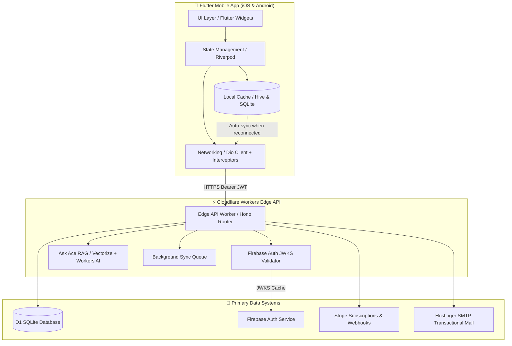
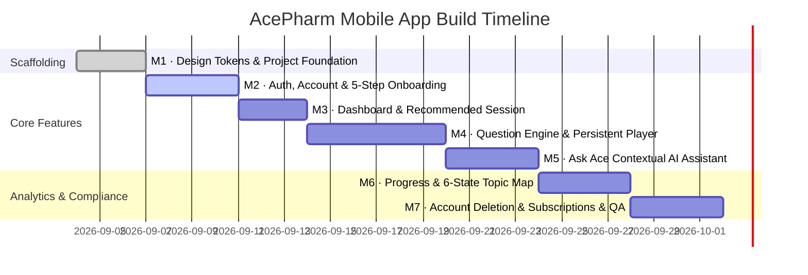

# 📱 AcePharm Mobile Companion App — Technical Implementation Plan
### *Cross-Platform iOS & Android Companion Client (Flutter / Dart 3.x)*

---

<div align="center">

[](https://flutter.dev)
[](https://dart.dev)
[](https://workers.cloudflare.com)
[](https://firebase.google.com)
[](https://acepharmexams.co.uk)

</div>

---

## 📑 Executive Summary & Grounding

This document outlines the end-to-end technical blueprint, architecture, design system translation, and release roadmap for the **AcePharm Mobile Companion App** (`mobile-app/`).

The mobile client is engineered directly from the requirements in **[Brief_AcePharmMobileApp_Numan.docx](file:///Users/pc/acepharm-web-app/docs/Brief_AcePharmMobileApp_Numan.docx)**, grounded in the **[Developer Brief v2.1](file:///Users/pc/acepharm-web-app/docs/AcePharm-Developer-Brief-v2.1.docx)** and **[Website Copy v2.0](file:///Users/pc/acepharm-web-app/docs/AcePharm-Website-Copy-v2.0.docx)**, and communicates seamlessly with the unified [`web-app`](file:///Users/pc/acepharm-web-app/web-app) backend infrastructure.

---

## 🏛️ System Architecture



---

## 🎨 Design System & Token Bridge (Section 3.3 Translation)

All visual styling is translated directly from the web design tokens (`tokens.css`) into a strongly typed `AceTheme` in Flutter, ensuring pixel-perfect fidelity without approximations.

### Color Tokens

| Token Name | Hex Code | Flutter Color Definition | Application / Purpose |
| :--- | :--- | :--- | :--- |
| **Ace Indigo** | `#4F46E5` | `Color(0xFF4F46E5)` | Primary brand accent, selected active states, focus rings |
| **Deep Indigo** | `#3730A3` | `Color(0xFF3730A3)` | Pressed/Active interactive button states, high-contrast text |
| **Indigo Wash** | `#F1F2FC` | `Color(0xFFF1F2FC)` | Pill backgrounds, subtle card tints, active navigation backgrounds |
| **Ink** | `#111827` | `Color(0xFF111827)` | Primary typography, question stems, lead-ins, headings |
| **Slate** | `#64748B` | `Color(0xFF64748B)` | Secondary descriptions, subheadings, unselected options |
| **Slate Light** | `#94A3B8` | `Color(0xFF94A3B8)` | Helper captions, metadata dates, question IDs |
| **Teal** | `#0F766E` | `Color(0xFF0F766E)` | Correct answer cues, positive calibration, active badges |
| **Teal Light** | `#EFFAF8` | `Color(0xFFEFFAF8)` | Correct answer background container, pill tint |
| **Danger Rose** | `#B91C1C` | `Color(0xFFB91C1C)` | Incorrect answer cues, danger warnings, account deletion |
| **Canvas** | `#F8FAFC` | `Color(0xFFF8FAFC)` | Primary app screen background |
| **Surface** | `#FFFFFF` | `Color(0xFFFFFFFF)` | Card containers, modal sheets, question option panels |
| **Border** | `#E2E8F0` | `Color(0xFFE2E8F0)` | Subtle hairline card borders, dividers, option outlines |

### Typography & Spacing Scale

> [!NOTE]
> - **Primary Font Family**: `Geist Sans` (via `google_fonts`) for all interface copy, prompts, and clinical vignettes.
> - **Monospace Font Family**: `Geist Mono` for question IDs (`ACP-CV-0012`), calculations, and mathematical dosages.
> - **Touch Targets**: Minimum **44×44 pt** enforced across all option rows, buttons, and icon tap targets.
> - **Spacing**: Strict 8-point base scale (`4px`, `8px`, `12px`, `16px`, `24px`, `32px`, `48px`).

---

## ⚡ Product Invariants & Non-Negotiables

These rules are strictly enforced across the mobile companion app to preserve clinical educational integrity:

```
┌────────────────────────────────────────────────────────────────────────────────────────┐
│                                 CRITICAL PRODUCT RULES                                 │
├────────────────────────────────────────────────────────────────────────────────────────┤
│ 1. Zero Pre-Submission Color  │ Options remain neutral upon selection. Absolutely no  │
│                               │ green/red visual hints before clicking Submit.        │
├───────────────────────────────┼────────────────────────────────────────────────────────┤
│ 2. Mandatory Confidence Catch │ Confidence rating (High / Med / Low) must be captured  │
│                               │ prior to submission (unless disabled in settings).     │
├───────────────────────────────┼────────────────────────────────────────────────────────┤
│ 3. Multi-Cue A11y Feedback    │ Post-submission feedback must include an icon + text   │
│                               │ label + color (e.g. "✓ Correct" / "✕ Incorrect").      │
├───────────────────────────────┼────────────────────────────────────────────────────────┤
│ 4. Individual Distractor Rationale│ Every incorrect choice receives its own dedicated  │
│                               │ rationale attributed to "AcePharm Clinical Editorial". │
├───────────────────────────────┼────────────────────────────────────────────────────────┤
│ 5. Five Discrete Metrics      │ 1st-Attempt, Practice, Repeat, Calibration & Coverage  │
│                               │ are kept visibly distinct. Never merged into one score.│
├───────────────────────────────┼────────────────────────────────────────────────────────┤
│ 6. Offline Answer Resilience  │ No answer is ever lost on network drop. Answers queue  │
│                               │ locally and sync automatically when internet restores. │
└────────────────────────────────────────────────────────────────────────────────────────┘
```

---

## 🗺️ Milestone Roadmap & Implementation Steps



### 🔹 Milestone 1: Project Scaffolding & Design System Bridge
- Initialize Flutter project under `mobile-app/` (`com.acepharm.app`).
- Implement `AceTheme`, `AceColors`, `AceTypography`, and `AceSpacing`.
- Build reusable UI primitives: `AceButton`, `AceCard`, `AceBadge`, `AceInput`, `AceModalSheet`.

### 🔹 Milestone 2: Auth, Account & 5-Step Onboarding
- Firebase Auth integration with Google JWKS-backed token validation.
- Login, Sign-up, Password Reset (with real-time password entropy meter).
- **5-Step Onboarding Flow**:
  1. Training stage selection (MPharm Year 2–4, Foundation, Oriel, IP).
  2. Primary revision target.
  3. Exam date countdown ticker.
  4. Daily question goal (default: 20).
  5. University / Institution affiliation.

### 🔹 Milestone 3: Dashboard & Recommended Next Session
- **Real-Time Revision Ring**: Circular daily target progress tracker (e.g., *14/20 completed*).
- **Weekly Ace Clinical Insight**: Dynamic clinical takeaways delivered via Cloudflare D1.
- **Explainable Recommendation Engine**:
  > *"Recommended because your first-attempt accuracy in Cardiovascular Therapeutics is 44%."* (Never an unexplained session recommendation).

### 🔹 Milestone 4: Question Practice Engine (The Core Feature)
- **Session Builder**:
  - Mode Selection: **Learn Mode** (untimed with immediate multi-stage rationales) vs **Timed Exam Mode** (Pearson VUE simulated countdown).
  - Curriculum Category filter across all 19 GPhC domains.
- **Question Screen UX**:
  - Pre-submission confidence selector.
  - Active recall **"Cover Options"** toggle.
  - Subtopic personal clinical notes & question bookmarking.
  - Isolated first-attempt telemetry vs subsequent practice attempts.

### 🔹 Milestone 5: Contextual "Ask Ace" AI Clinical Tutor
- Integrated *"Ask Ace about this question"* sheet beneath explanation cards.
- Streamed responses from `/api/v1/ace/chat` via Cloudflare Workers AI.
- Explicit guideline citations (BNF & NICE NG guidelines).
- Graceful refusal when clinical queries fall outside the reviewed curriculum.

### 🔹 Milestone 6: Progress & Diagnostic Calibration
- **5 Separate Analytics Pillars**:
  1. *First-Attempt Accuracy* (prominently featured).
  2. *Practice Accuracy* (inclusive of second/third attempts).
  3. *Repeat Accuracy*.
  4. *Confidence Calibration Grid* (Overconfident vs Calibrated vs Underconfident).
  5. *Curriculum Coverage Percentage*.
- **19-Topic Mastery Grid** with 6 status labels:
  $$\text{Not started} \longrightarrow \text{First pass} \longrightarrow \text{Needs attention} \longrightarrow \text{Developing} \longrightarrow \text{Secure} \longrightarrow \text{Due for review}$$

### 🔹 Milestone 7: Account Management, Account Deletion & Store Release
- **Subscription Status Screen**: Displays active plan tier, renewal date, and deep link to web customer portal.
- **In-App Account Deletion Flow (Apple Guideline 5.1.1(v) & GDPR Compliance)**:
  - Accessible via *Settings → Account → Close / Delete Account*.
  - 2-step confirmation modal detailing permanent data loss.
  - Re-authentication security check before issuing `DELETE /api/v1/user/account`.
  - Local cache wipeout (Hive & secure storage) and graceful exit to the onboarding screen.
- **Distribution Setup**: Fastlane build automation for Google Play Internal Testing and Apple TestFlight.

---

## 📁 Directory Structure (`mobile-app/`)

```
mobile-app/
├── android/                   # Native Android wrapper & Gradle configs
├── ios/                       # Native iOS Xcode workspace & Podfiles
├── assets/
│   ├── fonts/                 # Geist-Regular, Geist-Bold, GeistMono-Medium
│   └── icons/                 # Brand SVG marks and status glyphs
├── lib/
│   ├── core/
│   │   ├── api/               # Dio HTTP client, JWT interceptor, retry logic
│   │   ├── database/          # Hive local database & offline answer queue
│   │   ├── theme/             # AceTheme, AceColors, AceTypography
│   │   └── utils/             # Formatters, connectivity watchers
│   ├── features/
│   │   ├── auth/              # Login, register, password reset, action handler
│   │   ├── onboarding/        # 5-step onboarding carousel
│   │   ├── dashboard/         # Daily goal ring, streak counter, recommendations
│   │   ├── practice/          # Question player, rationale sheet, session summary
│   │   ├── ace/               # Ask Ace AI streaming chat bottom sheet
│   │   ├── progress/          # 5-metric dashboard, 19-category status map
│   │   └── settings/          # Account, deletion modal, preferences, subscription
│   └── main.dart              # App bootstrap & Riverpod ProviderScope
└── pubspec.yaml               # Flutter dependencies & assets declarations
```

---

## 🧪 Comprehensive Verification & QA Matrix

```
┌─────────────────────────────────────────────────────────────────────────────────────────────────────────┐
│                                       MANUAL QA VERIFICATION PLAN                                       │
├──────┬────────────────────────────┬────────────────────────────────────────────────────────────┬────────┤
│ Ref  │ Feature / Flow             │ Expected Behaviour                                         │ Status │
├──────┼────────────────────────────┼────────────────────────────────────────────────────────────┼────────┤
│ QA-1 │ Pre-Submit Confidence      │ Submit button is disabled until a confidence rating is set.│  [ ]   │
│ QA-2 │ Zero Pre-Submit Color      │ Selected option remains neutral border. No green/red cues. │  [ ]   │
│ QA-3 │ Distractor Rationales      │ Every wrong answer option reveals an independent rationale.│  [ ]   │
│ QA-4 │ Offline Mode Resilience    │ In Airplane mode, submitted answers queue without error.   │  [ ]   │
│ QA-5 │ 5 Progress Metrics         │ First-attempt accuracy is visibly distinguished.           │  [ ]   │
│ QA-6 │ Account Deletion           │ Account deletion wipes D1 data, purges cache & logs out.   │  [ ]   │
│ QA-7 │ Ask Ace Citations          │ Ask Ace provides BNF / NICE citations and refuses out-of-   │  [ ]   │
│      │                            │ scope clinical advice.                                     │        │
└──────┴────────────────────────────┴────────────────────────────────────────────────────────────┴────────┘
```

### Automated CLI Verification Commands

```bash
# 1. Analyze and check lint rules
flutter analyze

# 2. Check formatting
dart format --output=none --set-exit-if-changed .

# 3. Run all unit and widget tests
flutter test --coverage

# 4. Build release artifacts
flutter build apk --release      # Android APK
flutter build appbundle --release # Android Play Bundle
flutter build ipa --release      # iOS TestFlight Archive
```

---

<div align="center">

**AcePharm UK Revision Platform** · *Built by pharmacists for pharmacy students.*  
Documentation maintained under `docs/` in `acepharm-web-app`.

</div>
