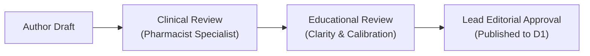

# AcePharm Clinical Authoring & Question Quality Guidelines

- **Target Audience:** UK Clinical Pharmacist Authors, Educational Reviewers, and Lead Editors.
- **Authority:** Developer Brief v2.1 (Section 4), Website Copy v2.0, and NICE/GPhC Assessment Frameworks.

---

## 1. The 4-Stage Explanation Schema (Mandatory)

Every Single Best Answer (SBA) and Calculation question must provide a structured 4-stage explanation:

### Stage 1: Key Takeaway Principle
- Exactly 1–2 sentences summarizing the core clinical rule or calculation formula.
- Must be understandable at a glance before reading detailed pathophysiology.

### Stage 2: Comprehensive Clinical Rationale
- Deep explanation of the clinical scenario, pathophysiology, therapeutic guidelines, and mechanism of action.
- Explains why the designated correct option represents best clinical practice under UK guidance.

### Stage 3: Distractor Analysis (Every Option A through E)
- **Zero exceptions:** Every single distractor (incorrect option) must have an explicit rationale explaining why it is sub-optimal, contraindicated, or mathematically flawed.
- Avoid generic feedback like *"This is incorrect"*; explain the clinical consequence (e.g., *"Thiazides increase serum urate and may precipitate acute gout"*).

### Stage 4: Verified Guidance Citations
- Authoritative reference link with publication/update year:
  - BNF (British National Formulary)
  - NICE Guidelines (e.g., NG136, NG28, CG181)
  - MHRA Drug Safety Updates
  - SmPC (Summary of Product Characteristics)

---

## 2. Pharmaceutical Calculations Quality Rules

1. **Units of Measure:** Write **“micrograms”** in full (never *“mcg”* or *“µg”* to prevent medication error misinterpretation).
2. **Explicit Working:** Show clear dimensional analysis and formula steps (e.g. Volume of distribution, elimination rate constant, infusion rate drop factor calculation).
3. **Rounding Rules:** State precision requirements clearly in the question stem (e.g., *"Give your answer to one decimal place"* or *"Round up to the nearest whole tablet"*).

---

## 3. Triple-Review Workflow

1. **Stage 1 (Clinical):** Verifies guideline currency, patient safety, dosing accuracy, and clinical realism.
2. **Stage 2 (Educational):** Checks difficulty grading, distractor plausibility, and formatting.
3. **Stage 3 (Lead Editorial):** Confirms compliance with British English conventions, banned phrases, and final publication tag.
